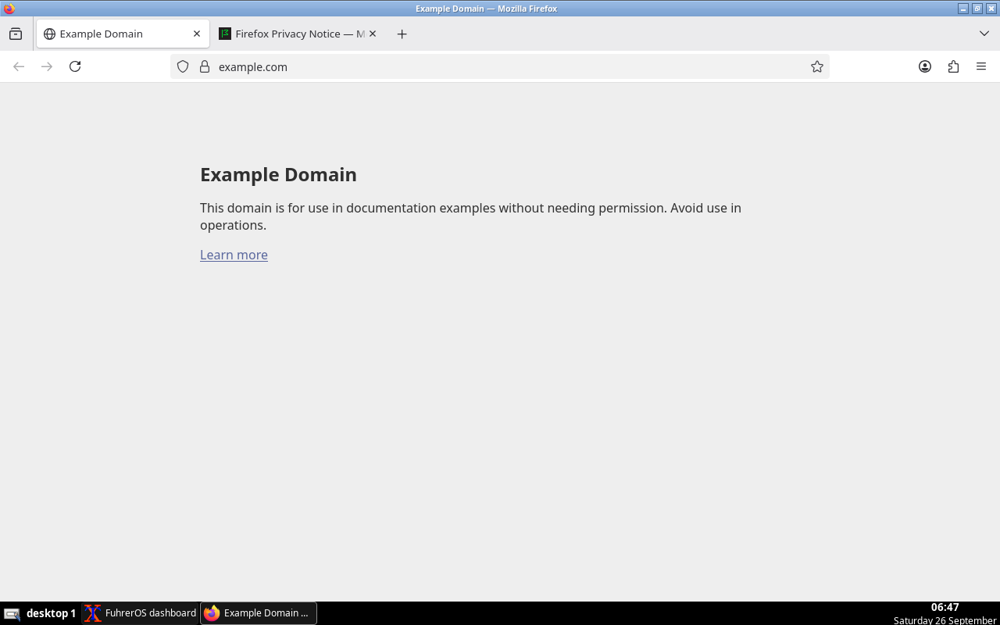

# FuhrerOS

**Adaptive operating-system specialisation for personal computing** — a
research prototype (BTP) that boots in QEMU/KVM and investigates whether an
OS can recognise the workload it is running and switch its I/O, cache,
scheduling and network policies to suit it, without giving up compatibility
with ordinary Linux applications.

FuhrerOS = **Linux 6.12** (Alpine 3.22 userspace) **+ the FuhrerOS adaptive
layer**:

- `fuhrerd` samples kernel counters every second, classifies the workload
  (IDLE, INTERACTIVE, CPU_BOUND, IO_SEQUENTIAL, IO_RANDOM, NETWORK_HEAVY,
  MIXED) and switches between three reversible policies (NORMAL, BATCHED,
  SPECIALIZED), with hysteresis. Every decision is logged as an `[ADAPT]`
  record.
- `libfuhrer` gives Fuhrer-aware programs an I/O path that follows the active
  policy: synchronous syscalls, batched io_uring, or io_uring + O_DIRECT.
- `fuhrer`: a CLI and research dashboard (`fuhrer status`) plus an
  interactive `fuhrer>` shell.
- `fuhrer-bench` and `scripts/benchmark.sh` run reproducible B0/B1/B2/B3
  experiments with ablations and graphs.



## Quick start

Requirements: Docker and QEMU (on Windows, both inside WSL2). See
[docs/vm.md](docs/vm.md).

```bash
./scripts/build.sh          # compile + unit tests + Alpine rootfs → qcow2 (Docker)
./scripts/run.sh            # boot; you land in a root shell on the serial console
./scripts/test.sh           # full acceptance test in a fresh VM
FUHRER_PROFILE=desktop ./scripts/build.sh && FUHRER_PROFILE=desktop ./scripts/run.sh   # graphical desktop
```

On Windows you can also run `fuhreros.cmd build`, `fuhreros.cmd run` and so
on, or call the scripts from Git Bash; they re-run themselves inside WSL.
`make`, `make run`, `make test`, `make benchmark` and `make clean` also work.

Inside the VM:

```text
fuhreros:~# fuhrer status
FUHREROS STATUS
────────────────────────
Runtime:        ACTIVE (fuhrerd pid 2024, v0.4.0)
Profiler:       ACTIVE
Policy engine:  ACTIVE
...
Workload:
  IO_RANDOM (high_small_io)
Policy:
  SPECIALIZED
...
fuhreros:~# fuhrer policy batched     # or auto | observe | off | normal | specialized
fuhreros:~# fuhrer log                # [ADAPT] records
fuhreros:~# fuhrer benchmark storage --pattern rand --bs 4k --time 10
fuhreros:~# fuhrer-selftest           # compatibility + acceptance checks
```

Credentials (development VM only): `root/fuhrer`, `fuhrer/fuhrer`; SSH with
`./scripts/ssh.sh`.

## Status

| milestone | state | evidence |
|---|---|---|
| M0 reproducible VM | ✅ | `test.sh`: boot, destroy/recreate, base image unchanged; KVM or TCG |
| M1 runtime (`fuhrer status/profile/policy/benchmark`) | ✅ | selftest `fuhrer-status`, `fuhrer-profile` |
| M2 profiler (CPU, mem, ctxsw, I/O ops/sizes/ratio/QD, net, per-process) | ✅ | unit tests; self-measured overhead |
| M3 rule-based classification | ✅ | unit tests; live `[ADAPT]` records |
| M4 policy framework (initialize/activate/deactivate/collect_metrics/name) | ✅ | knob unit tests incl. crash recovery |
| M5 static policy benchmark | ✅ | `benchmark.sh --suite main` → experiments/ |
| M6 adaptive controller with hysteresis | ✅ | `test.sh` adaptation check |
| M7 switching cost | ✅ measured | `switch_ms` per switch (D-014), ablation suite |
| M8 storage fast path (io_uring, O_DIRECT, batching) | ✅ | libfuhrer; tests in the VM |
| M9 adaptive storage | ✅ | main + transition suites |
| M10/M11 network policy (busy-poll, NAPI budget) | ⚙️ first cut | knobs present; only loopback benchmarks so far |
| M12 adaptive cache (read-ahead) | ⚙️ first cut | read-ahead is a policy knob; no dedicated experiment yet |
| M13 kernel integration | ⏳ not started | by design: userspace first |
| M14 compatibility: curl, Python, GCC, Git, editor, text browser, **Firefox** | ✅ | selftest; screenshot above |
| M15 full benchmark | ✅ first campaign | [docs/experiments.md](docs/experiments.md) |

Results are summarised in [docs/experiments.md](docs/experiments.md). The raw
data and per-experiment reports are in `experiments/E-*/summary.md`. No
number anywhere in this repository was produced other than by running the
benchmark.

## Repository

```text
adaptive/          profiler/, features/ (classifier), policy/ (knobs + 3 policies),
                   controller/ (engine, config, fuhrerd), include/fuhrer/
runtime/           cli/fuhrer.c, libfuhrer/ (policy-following I/O, liburing)
benchmarks/        fuhrer-bench.c (storage, cpu, memory, net, transition)
tests/unit/        C unit tests (run in the build container and inside the VM)
vm/image/          Dockerfile, mkimage.sh, overlay/ (services, config, branding), desktop/
vm/configs/        dev / bench / stress VM definitions
scripts/           build, run, debug, reset, ssh, test, benchmark, analyze, screenshot
experiments/       E-NNN result directories (config, raw data, summary, graphs)
docs/              research-design, architecture, literature, decisions, experiments, vm
research-log/      decisions/, experiments/, failures/ (F-XXX)
legacy/            the original 16-bit bootloader experiment, preserved
```

## Design in one paragraph

The research contribution is the adaptation, not a new kernel (D-001), so
FuhrerOS builds on Linux, following the UKL lesson that you don't have to
throw away Linux to get specialisation. A policy is a column of reversible
kernel tunables plus a hint to libfuhrer (D-007). Examples: read-ahead, I/O
scheduler, request merging, completion affinity, writeback deferral, socket
busy-polling, NAPI budget and the EEVDF base slice. Originals are saved
before the first change and restored on exit, even after a crash. Nothing
that affects durability is touched. See
[docs/architecture.md](docs/architecture.md) and
[docs/decisions.md](docs/decisions.md).
