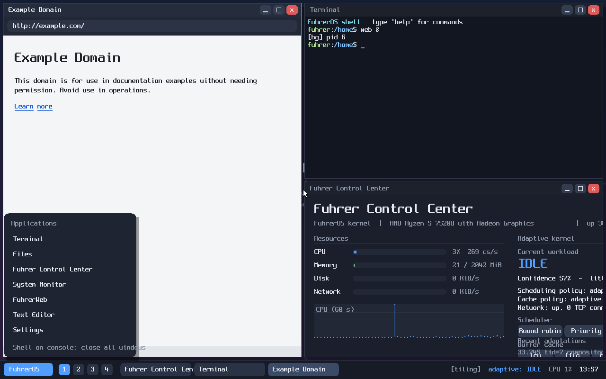

# FuhrerOS

**An x86-64 operating system with its own kernel, written from scratch**, and a
research platform for *workload-aware adaptive scheduling and caching* on
personal computers.

```text
================================
        FUHREROS KERNEL
================================

Architecture : x86_64
Bootloader   : Limine 11.4.1
Kernel       : FuhrerOS 0.1.0 (from-scratch)
Status       : BOOTED
```



## What is in it

| layer | FuhrerOS component |
|---|---|
| boot | Limine (BIOS + UEFI ISO); everything after the handoff is FuhrerOS |
| CPU | GDT/TSS, IDT, exceptions with symbolised panics, LAPIC/IOAPIC via ACPI, TSC + LAPIC timer (1000 Hz) |
| memory | bitmap frame allocator, own 4-level page tables (NX, WP, guard pages), slab heap |
| scheduling | kernel threads, preemptive context switching, **4 pluggable policies** (round-robin, priority, low-latency, **adaptive**), per-task **workload profiler** |
| processes | ring-3 processes, ELF64 loader, 50+ native syscalls, threads, pipes, message ports |
| storage | PCI, virtio-blk (MSI-X), **buffer cache with 5 policies incl. adaptive**, VFS, **FFS0** (own filesystem), tarfs, ramfs, devfs, procfs |
| network | virtio-net, Ethernet, ARP, IPv4, ICMP, UDP, DHCP, **TCP**, sockets; DNS, HTTP client and server in user space |
| graphics & desktop | framebuffer, **compositor + window manager** (move/resize/snap/max/min, workspaces, overview, tiling, lock screen), taskbar + launcher |
| input | PS/2 keyboard and mouse, **gesture recognizer** (1–4 finger gestures) |
| user space | libfu (libc subset + GUI toolkit), init, a shell with pipes/redirection/history, 45+ commands, 8 desktop apps |

Desktop apps: Terminal, Files, **Fuhrer Control Center** (live view of the
adaptive kernel), System Monitor, FuhrerWeb (HTTP page viewer), Editor,
Settings.

## Quick start (Windows + WSL 2)

```bash
./toolchain/build-toolchain.sh && ./toolchain/get-limine.sh   # once
./scripts/build.sh      # kernel + user space + disk + ISOs  -> BUILD: PASS
./scripts/run.sh        # boots the desktop in a QEMU window
./scripts/test.sh       # self-test boot: every kernel stage + user space + network
```
See [docs/development-environment.md](docs/development-environment.md).
In the desktop: Super opens the launcher, Ctrl+Alt+T a terminal, Super+T
tiling, Super+O the overview.

## Status (NEW_EXPLANATION §34)

| milestone | state | evidence |
|---|---|---|
| M0 environment | ✅ | GCC 15.2 x86_64-elf cross toolchain, Limine, build scripts |
| M1 bootable kernel | ✅ | banner; `VERIFY linux-absent PASS` |
| M2 CPU + interrupts | ✅ | `idt.exception.int3`, `apic.timer.ticks` (50 ticks / 50 ms) |
| M3 memory | ✅ | `pmm.*`, `vmm.*`, `heap.*` |
| M4 kernel tasks | ✅ | `sched.concurrent.*` for 4 policies, `sync.mutex`, `sync.waitqueue` |
| M5 processes + syscalls | ✅ | ring-3 `cli` → #GP kills only the process; kernel-memory read → #PF |
| M6 shell | ✅ | pipelines, redirection, history, 45+ commands |
| M7 storage | ✅ | virtio-blk + VFS + FFS0 root |
| M8 file programs | ✅ | `usertest`: create, cp, mv, rm, 1 MiB file, rmdir |
| M9 networking | ✅ | DHCP, own-stack TCP echo (20 000 B), DNS + HTTP to example.com |
| M10 graphics | ✅ | compositor with damage tracking |
| M11 desktop | ✅ | window manager, launcher, 8 apps (screenshots in docs/images) |
| M12 input | ✅ / ⚠️ | keyboard, mouse, gesture recognizer (verified with synthetic touch frames; no real touchpad driver) |
| M13 adaptive scheduler | ✅ | profiler + adaptive policy; see results |
| M14 adaptive storage | ✅ | adaptive buffer cache; see results |
| M15 network + browser foundation | ✅ / ⚠️ | HTTP client/server, FuhrerWeb viewer; no TLS, not a browser engine |
| M16 research evaluation | ✅ | experiments E-1xx: [docs/experiments.md](docs/experiments.md) |
| M17 desktop stress | ⚠️ partial | desktop + benchmarks exercised; no porting of real browser/compiler |
| M18 real hardware | ⏳ | ISO is a hybrid BIOS/UEFI image; **not tried on hardware** |

## Documentation
[architecture](docs/architecture.md) ·
[kernel design](docs/kernel-design.md) · [memory](docs/memory.md) ·
[scheduler](docs/scheduler.md) · [processes](docs/processes.md) ·
[syscalls](docs/syscalls.md) · [filesystem](docs/filesystem.md) ·
[networking](docs/networking.md) · [graphics](docs/graphics.md) ·
[input](docs/input.md) · [desktop](docs/desktop.md) ·
[UI design](docs/ui-design.md) · [research design](docs/research-design.md) ·
[experiments](docs/experiments.md) · [literature](docs/literature.md) ·
[decisions](docs/decisions.md) · [failures](research-log/failures/README.md) ·
[how it was built](EXPLANATION.md)

The earlier Linux-based prototype (Linux + adaptive layer) is preserved in
[linux-prototype/](linux-prototype/) with its own documentation and results.
