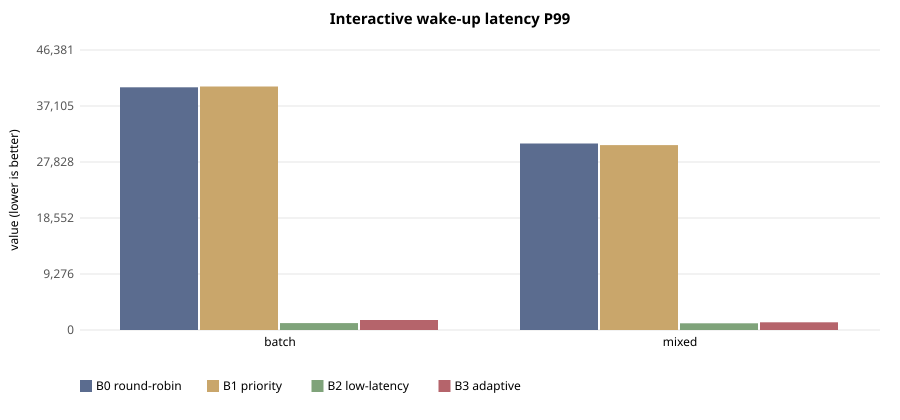
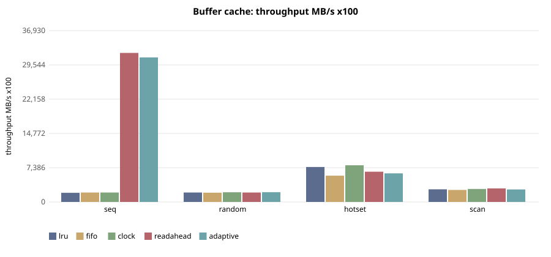
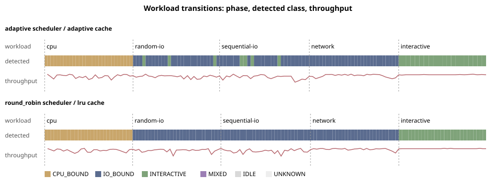

# Experiments (M16)

The question behind these experiments: **does a small kernel that classifies
what is running, and adapts its scheduler and buffer cache to that class, do
better than fixed policies?** Every number below is copied from a run's
`summary.md` in `experiments/`, and every run can be reproduced with one
command. Values that were not measured are written as NOT RUN.

Final runs: **E-117 (sched), E-118 (cache), E-119 (transition), E-120
(ablation)**, all on one binary built from commit `e942a12`. Their configs
say `e942a12-dirty` only because research-log/ and tools/ documentation files
were edited while the campaign ran. No kernel, user-space or rootfs file
differed from the commit.

## Setup

| | |
|---|---|
| host | AMD Ryzen 5 7520U, Windows 11 → WSL 2 (Linux 6.6.87.2) → QEMU 10.2.1 |
| acceleration | **KVM** (nested inside WSL 2), printed as `Acceleration: KVM` by every script |
| guest | FuhrerOS 0.1.0; 4 vCPUs offered, **1 used** (uniprocessor kernel), 4096 MB |
| devices | virtio-blk (FFS0 raw image, host cache=writeback), virtio-net (slirp) |
| clock | TSC, calibrated at boot; scheduler tick 1000 Hz |

`./scripts/experiment.sh SUITE` builds an ISO with `bench=SUITE` on the
kernel command line, boots it headless, and waits for the guest to power
itself off. Init runs `rootfs/etc/bench/SUITE.sh`. The script then turns the
serial log into `results.jsonl`, `summary.md` and SVG graphs
(`scripts/analyze.py`). The config, the suite script and the raw log are
kept with every run.

## Workloads and metrics

- **schedbench** runs three worker types:
  - an interactive *probe* that sleeps 10 ms and then does about 0.2 ms of work;
  - *CPU workers* that compute prime sieves;
  - *I/O workers* that make random 4 KiB reads through the buffer cache.

  Scenario `mixed` is 3 CPU workers + 1 I/O worker + the probe; `batch` is
  4 CPU workers + the probe. Each run lasts 10 s, and the policy order is
  rotated every repetition.
  - **Dispatch latency** is the kernel-measured time from the probe becoming
    runnable to it running. It is the part a scheduling policy controls.
  - **Wake latency** is requested wake-up to actual run. It also contains
    the 1 ms timer granularity, whose phase depends on the per-boot timer
    calibration (F-117), so it is only comparable within one run
    directory.
- **iobench** reads a 64 MiB file through a 1024-block (4 MiB) cache, 6 s per
  run, 2 repetitions. The access patterns are:
  - `seq`;
  - `random`;
  - `hotset` (80 % of reads in 2 MiB);
  - `scan` (hot set interleaved with a sequential scan).

  The hit rate includes filesystem metadata blocks.
- **transition** runs five 8 s phases: CPU → random I/O → sequential I/O →
  loopback TCP → interactive. It samples the kernel's system-level class
  every 250 ms.
- **Policy decision time** ("sched overhead") is TSC time spent in the
  scheduler's requeue + select. It excludes the context switch itself and
  the profiler, which is measured separately.

Baselines (NEW_EXPLANATION §37):
- B0 round-robin;
- B1 priority;
- B2 low-latency, the "manually selected" policy for interactive work;
- B3 adaptive.

## Results

### Scheduler, E-117 (median of 5 runs, CV in parentheses)

Mixed scenario:

| metric | B0 round-robin | B1 priority | B2 low-latency | B3 adaptive |
|---|---|---|---|---|
| dispatch p50 (µs) | 29,062 (0%) | 29,062 (0%) | 7 (21%) | 6 (0%) |
| dispatch p99 (µs) | 29,820 (1%) | 29,621 (5%) | 104 (11%) | 84 (60%) |
| response p99 (µs) | 41,002 (1%) | 40,665 (5%) | 11,157 (1%) | 11,339 (3%) |
| batch jobs/s (x100) | 960,004 (1%) | 964,124 (11%) | 958,827 (4%) | 948,594 (1%) |
| I/O ops/s | 21 (2%) | 22 (3%) | 509 (0%) | 501 (0%) |
| context switches/s | 188 | 188 | 1,958 | 1,753 |
| policy decision time (ns/s) | 27,646 | 25,849 | 132,013 | 124,805 |
| kernel's system class | CPU_BOUND | CPU_BOUND | IO_BOUND | IO_BOUND |

Batch scenario: dispatch p99 B0 39,219, B1 39,360, B2 52, B3 142 µs. Batch
jobs/s ranged from 970,108 to 979,645 (x100) across all four policies.



### Buffer cache, E-118 (median of 2 runs; MB/s)

| workload | LRU | FIFO | CLOCK | read-ahead | adaptive |
|---|---|---|---|---|---|
| seq | 19.67 | 20.28 | 20.25 | 321.13 | **311.58** |
| random | 20.28 | 19.92 | 20.80 | 20.26 | **21.02** |
| hotset | 75.32 | 56.62 | 78.96 | 65.12 | **61.55** |
| scan | 27.22 | 25.90 | 28.02 | 29.18 | **26.87** |

Sequential read p99: LRU 499 µs, adaptive 74 µs. Hit rate on seq: LRU 745‰,
adaptive 999‰. Cache CPU per read was 338–938 ns, except sequential
read-ahead and adaptive (7,814 / 8,060 ns); that figure includes issuing the
prefetches. All policies use the same 1024 blocks.



### Workload transition, E-119

| run | cpu | random-io | sequential-io | network | interactive |
|---|---|---|---|---|---|
| adaptive (sched + cache) | 284 ms | 290 ms | 318 ms | 307 ms | 401 ms |
| round_robin + LRU | 301 ms | 286 ms | 291 ms | 286 ms | 300 ms |

Each value is the delay from the phase start to the first 250 ms sample
whose system class matches the phase.



### Ablations, E-120 (mixed scenario, median of 3; cache LRU except A5)

| variant | dispatch p50 (µs) | dispatch p99 (µs) | batch jobs/s (x100) | I/O ops/s |
|---|---|---|---|---|
| A1 controller off (priority) | 29,058 | 30,051 | 985,723 | 20 |
| A2 profiling off (adaptive, all UNKNOWN) | 11,205 | 17,062 | 985,365 | 44 |
| A3 profiling on, no switching (round-robin) | 29,057 | 29,341 | 974,720 | 21 |
| A4 adaptive scheduler | 6 | 56 | 957,107 | 500 |
| A5 adaptive scheduler + adaptive cache | 6 | 71 | 958,783 | 501 |
| A6 window 25 ms | 6 | 60 | 958,045 | 503 |
| A6 window 500 ms | 6 | 14,042 | 960,963 | 473 |
| A7 hysteresis 1 | 7 | 77 | 954,234 | 508 |
| A7 hysteresis 5 | 6 | 11,990 | 967,384 | 484 |

The profiler used 8.86 ms in total during the ablation boot, which ran at
least 27 × 10 s of benchmarks.

## Answers to the research questions

- **RQ1: Can runtime workload characteristics select beneficial policies?**
  Yes, within these workloads.
  - In all five adaptive mixed runs of E-117, the profiler put the I/O
    worker in IO_BOUND, the probe in INTERACTIVE and the CPU workers in
    CPU_BOUND (per-task classes are in the run summaries). Under
    round-robin the starved I/O worker looks INTERACTIVE, so the class
    depends on the policy in force.
  - The class-based parameters gave B2-level latency with no manual policy
    choice.
  - A2 and A3 show that both parts are needed.
- **RQ2: Does adaptive beat fixed scheduling for heterogeneous workloads?**
  It beats B0 and B1 clearly:
  - dispatch p50 6 µs vs 29 ms;
  - I/O throughput about 24× higher.

  It does **not** clearly beat the manually selected B2. The p99 was
  better in the mixed scenario (84 vs 104 µs) but worse in the batch
  scenario (142 vs 52 µs), with high variance.
- **RQ3: What does profiling cost?**
  - The profiler itself cost below 0.004 % of CPU (8.86 ms over at least
    270 s).
  - Adaptive policy decisions cost about 0.12–0.14 ms per second.
  - The larger cost is about 9× more context switches than round-robin.
    Their CPU time is **UNKNOWN - REQUIRES VERIFICATION** (not measured).
- **RQ4: How fast should FuhrerOS react?**
  - The class follows a phase change within 284–401 ms.
  - Reacting slower hurts. A 500 ms window or hysteresis 5 raised dispatch
    p99 by about 210–250×, because new threads wait behind CPU workers
    until they are classified.
  - Faster than 100 ms (a 25 ms window) gave no measurable gain.
- **RQ5: Can adaptive caching help without more memory?**
  Partly.
  - On sequential reads it matches the dedicated read-ahead policy (97 %;
    15.8× LRU) with the same memory.
  - On random reads it is the best policy, and on scan it is within 8 % of
    the best.
  - On hotset it is 18 % below LRU and 22 % below CLOCK.
- **RQ6: Can it improve responsiveness without hurting batch throughput?**
  Yes in this setup: B3 had 1.2 % fewer batch jobs than B0 in the mixed
  scenario, within the run-to-run variation of B1 (CV 11 %).
- **RQ7: Can this fit in a small from-scratch kernel?**
  - The adaptive scheduler is 124 lines of C++ (`kernel/sched/adaptive.cpp`)
    and the profiler is one C file, behind the same policy interface as the
    fixed policies.
  - The whole kernel plus user space is about 18,400 lines.

## How the results changed, and why that matters

The final numbers exist only because the earlier runs were checked instead
of reported. Each E-1xx run before E-117 exposed a bug, recorded under
[research-log/failures](../research-log/failures/README.md):

| found in | failure | effect on earlier numbers |
|---|---|---|
| E-101 | F-109 system class IDLE for blocking workloads | class column wrong |
| E-102 | F-114 metadata hid sequential streams | read-ahead never ran |
| E-103, E-107 | F-115 aging did not lift IDLE-class tasks | "4.4–5.7 s detection" was a starved sampler |
| E-105, E-108 | F-117 wake latency follows the per-boot tick phase | 44 µs vs 975 µs for the same configuration |
| E-106 | F-116 read-ahead evicted its own prefetches | 110k prefetches, 6k used |
| E-110 | F-118 a wake-up on an idle CPU waited for the next tick | every disk read about 1 ms; I/O about 5× too slow |
| E-114 | F-119 evict-behind evicted metadata | adaptive cache no better than LRU |

The records for all runs are in
[research-log/experiments](../research-log/experiments/README.md).

## Threats to validity

- **Virtualisation.** The stack is nested (Windows → WSL 2 → KVM). Absolute
  times are not bare-metal times. The comparisons are between policies
  within one boot.
- **One CPU.** FuhrerOS uses one CPU, so multi-core scheduling effects are
  not studied.
- **Synthetic workloads.** Whether the results transfer to real desktop use
  is UNKNOWN - REQUIRES VERIFICATION.
- **Few repetitions** (5 sched, 2 cache, 3 ablation, 1 transition). Several
  tail-latency cells have a CV of 40–60 %, so B2 vs B3 differences in p99
  are not significant.
- **Shorter phases.** Transition phases are 8 s, not the 60 s of
  NEW_EXPLANATION §36.
- **Hit rates include metadata.** A read that misses its data block still
  hits its inode and indirect blocks, so LRU's sequential hit rate is about
  75 %, not 0 %.
- **No comparison with Linux.** NEW_EXPLANATION §37 asks for comparisons
  inside FuhrerOS. The Linux-based prototype's numbers
  (linux-prototype/) come from a different system and are not comparable.

## Reproduce

```bash
./scripts/build.sh
./scripts/experiment.sh sched       # also: cache | transition | ablation
```
