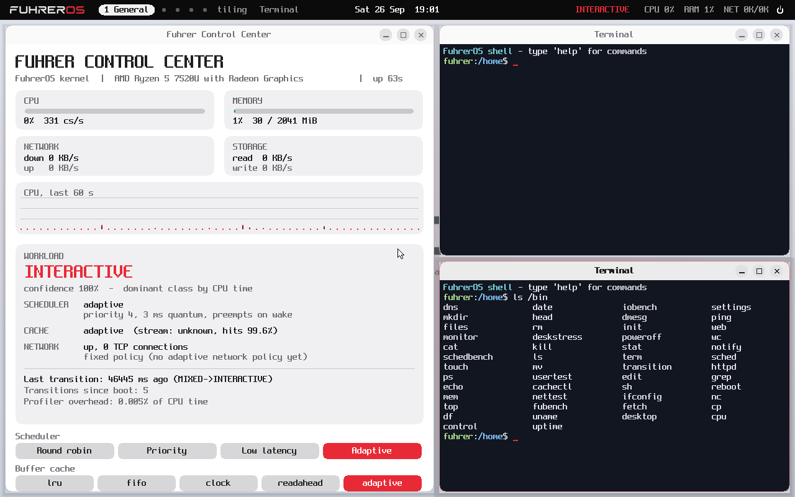
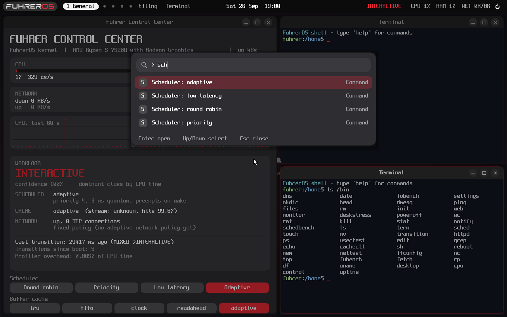
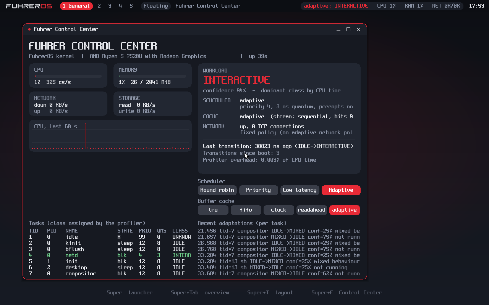

# UI design (UI_SUGGESTION.md)

The design brief is [UI_SUGGESTION.md](../UI_SUGGESTION.md): *modern
Arch-like minimalism + polished desktop UX + keyboard-first + touchpad-first
+ a native FuhrerOS identity*. Reference systems (Hyprland, Waybar, GNOME,
KDE, COSMIC, Windows 11, macOS, Niri) were used for their ideas only. No code
or artwork from them is used. Everything is drawn by the FuhrerOS compositor
(`kernel/gfx/compositor.c`) and the libfu toolkit (`user/lib/gui.c`).

## Visual language (§3, §4, §29–§31)

- **Brand.** The FuhrerOS wordmark (`logo.png`) is converted by
  `tools/logo2c.py` into two alpha masks at five heights. "FUHRER" is tinted
  with the theme's text colour and "OS" with the accent. The logo therefore
  works on dark and light themes without separate artwork. It appears on the
  top bar (launcher button), the wallpaper and the lock screen.
- **Colour.** Dark-first neutral surfaces with one accent. The default accent
  is the logo's red. The alternatives are blue, teal, amber and violet. There
  is a light theme. The desktop hands the theme to applications
  (`DESK_THEME`), and they redraw on `WEV_THEME`.
- **Windows.** 10 px corner radius, 1 px border (accent when focused), a
  30 px title bar with a focus dot, − □ × buttons with hover state, and a
  soft three-layer shadow. Maximised and focus-mode windows have square
  corners.
- **Type.** Spleen 8×16 bitmap font everywhere. A scalable UI font would
  need a font rasteriser, which FuhrerOS does not have. See Limits.
- **No blur, no transparency effects, no animations** (§40): composition
  stays a memcpy of a pre-rendered wallpaper plus the windows.

## What exists

| spec | FuhrerOS | how to use |
|---|---|---|
| §5 compact top bar | logo/launcher · named workspaces · layout mode · focused title · adaptive state, CPU, RAM, network · clock | clicking the status group opens the Control Center |
| §6 workspaces | 1–9 (default 5: General, Development, Browser, Research, Misc), windows-present dot | Super+1..9; Super+Shift+N moves the window *and follows*; Super+Ctrl+←/→; launcher "add/remove workspace", `rename NAME` |
| §7 floating / tiling / focus | per workspace, switch without restarting apps | Super+T cycles; click the mode pill |
| §8 tiling | master/stack; resize split, rotate, swap, float and re-tile a window | Super+[ ], Super+R, Super+Shift+←/→, Super+Space |
| §9–10 launcher + command palette | fuzzy search over apps, commands and files under /home; `>` limits to commands; `workspace N`, `rename NAME`, `open PATH` | Super; ↑↓ Enter Esc |
| §11, §36 Control Center | workload + confidence + reason; what the scheduler/cache/network do about it; last transition and count; profiler overhead; policy buttons; per-task classes | Super+F, 4-finger tap, the bar |
| §12, §32 notifications | compact, stacked, auto-dismiss after 6 s, click to dismiss; adaptive-class toasts are **off by default** | `notify TITLE TEXT`; Settings → Desktop |
| §13 shortcuts | all listed ones (Settings → Shortcuts) | |
| §14–§23 touchpad | tap-to-click, natural scrolling, pointer/scroll speed, disable-while-typing, 3/4-finger swipes and taps with configurable actions, pinch → zoom event | Settings → Touchpad |
| §27–28 animation, reduced motion | eased 60 fps effects (UI-D-007); Reduce Motion disables them | Settings → Appearance, Quick Settings |
| §33 files, §34 terminal, §35 monitor | existing apps, now themed; Files and Editor accept a path argument | |
| §40 measure | `/proc/desktop`: average/max composition time, input→frame latency, last workspace-switch latency | `cat /proc/desktop` |

 

## Decision records

### UI-D-001 — Top bar instead of a bottom taskbar
- **Problem:** Where do the launcher, workspaces and status live?
- **References:** Waybar/Hyprland (top bar), GNOME (top bar), Windows (bottom taskbar).
- **Options:** keep the bottom taskbar with window buttons; top bar with workspaces; both.
- **Chosen:** a 32 px top bar with no per-window buttons. Windows are reached through Alt+Tab, the overview and workspaces.
- **Reason:** The brief's layout (§5) and keyboard-first use. Window buttons duplicate the switcher and use width that the status group needs.
- **Performance impact:** none measurable (one strip of the full-screen composition).
- **Accessibility impact:** Window buttons are gone for mouse-only users. The overview (Super+Tab, 3-finger up) and the switcher cover this.
- **Implementation:** `draw_bar()` in `kernel/gfx/compositor.c`.
- **Validation:** screenshots in `docs/images/`. Click targets are tested by hand in QEMU.

### UI-D-002 — Logo as tintable alpha masks
- **Problem:** How to show the brand on dark and light themes with one asset?
- **Options:** RGB bitmap per theme; one RGB bitmap; alpha masks tinted at draw time.
- **Chosen:** two 8-bit masks ("FUHRER", "OS") at 12/16/24/40/64 px, generated from `logo.png`.
- **Reason:** Theme and accent changes apply to the logo automatically. There is no image decoder in the kernel.
- **Performance impact:** 133,056 bytes of kernel data (0.48 MB of generated C source).
- **Accessibility impact:** The logo follows the text colour, so it has the same contrast as text.
- **Implementation:** `tools/logo2c.py`, `kernel/gfx/logo.c`, `surf_logo()`.
- **Validation:** light and dark screenshots.

### UI-D-003 — Launcher is also the command palette
- **Problem:** §9 wants app, command and file search; §10 wants a command palette.
- **References:** GNOME search, KRunner, VS Code palette, Raycast.
- **Options:** separate palette; one field with a prefix.
- **Chosen:** one field. Empty query shows the apps; typing searches apps, commands and files; `>` restricts the search to commands.
- **Reason:** one shortcut (Super) to learn.
- **Performance impact:** searching is O(items) in interrupt context (at most 40 results, 192 indexed files). Indexing `/home` runs in the compositor thread (F-121).
- **Accessibility impact:** fully keyboard-driven.
- **Implementation:** `build_items()`, `run_item()`, `defer()`.
- **Validation:** launcher screenshots; F-121 regression session.

### UI-D-004 — Three layout modes per workspace
- **Problem:** §7 asks for floating, tiling and focus without restarting apps.
- **Options:** a global mode; a per-workspace mode.
- **Chosen:** per workspace, cycled with Super+T. Tiles keep a stable order (`seq`) that does not change with focus. The first tile is the master.
- **Reason:** A "Development" workspace can tile while "General" floats. Before this change, focusing a window made it the master (the old z-order tiling), which reshuffled the layout on every click.
- **Implementation:** `retile()`, `set_mode()`, `tile_neighbour()`.
- **Validation:** screenshots (tiling in both themes, focus mode).

### UI-D-005 — Adaptive-kernel notifications are opt-in
- **Problem:** §12 wants class changes visible, and §12/§32 forbid interrupting the user.
- **Chosen:** Off by default. When on, they are small toasts with no sound or focus change. The Control Center always shows the last transition and the count.
- **Reason:** Class changes happen whenever typing starts or stops. Even with hysteresis (F-120), that is too often for a notification.
- **Implementation:** `adaptive_watch()`; Settings → Desktop.

### UI-D-006 — Default gesture mapping
- **Problem:** §18–19 list defaults, some of which depend on a "configured mode".
- **Chosen:**
  - 3-finger left/right → previous/next workspace;
  - 3-finger up → overview; 3-finger down → show desktop;
  - 3-finger tap → launcher;
  - 4-finger left/right → workspaces, up → overview, down → desktop;
  - 4-finger tap → Control Center.

  Every entry can be changed in Settings → Touchpad.
- **Reason:** horizontal workspaces match horizontal swipes (the brief's own UI-D example). The settings example in §20 uses these defaults.
- **Validation:** recognizer self-tests (`gesture.*`). The desktop actions are not validated on a real touchpad (see Limits).

### UI-D-007 — Motion: eased animations on a frame clock
- **Problem:** The desktop jumped between states. The user asked for a smoother UI.
- **References:** GNOME Shell (workspace slides, overview zoom), Windows 11 and macOS (window open zoom).
- **Options:** (A) no animation; (B) timers per effect; (C) one frame clock, with every effect computed from its start time and an ease-out curve.
- **Chosen:** C.
  - While anything moves, the compositor composes every 16 ms.
  - The effects are:
    - a window opens with a 92 %→100 % zoom and fade (180 ms);
    - workspaces slide in the direction of travel (220 ms);
    - the launcher and Quick Settings slide down while the backdrop darkens (160 ms);
    - the overview fades in and its thumbnails and dash settle (200 ms);
    - notifications slide in from the right (220 ms).
  - Reduce Motion turns every effect off.
- **Reason:** A late frame shows a later state instead of queueing work, and input is never blocked.
- **Performance impact** (`fubench desktop`, E-136 vs E-137):
  - One slide draws 14 frames in 220 ms.
  - The worst animation frame was 15.4 ms, near the 16.7 ms budget. Two changes brought it to 3.96 ms:
    - shadows now blend only their visible rim instead of the whole rectangle 3–5 times per window;
    - transformed windows use two-channel integer blending.
  - Average composition went from 2.25 to 1.53 ms, and the worst frame of the run from 89 to 9.4 ms.
  - Cost: during an animation, the first frame after a request can wait up to one frame (the workspace switch "request → frame" is 12.0 ms in E-137 vs 1.3 ms without motion).
- **Accessibility impact:** Reduce Motion (Settings → Appearance, Quick Settings) disables all of it.
- **Validation:** E-136, E-137. The effects themselves are too fast for the QEMU monitor's screendump to capture mid-flight.

### UI-D-008 — Fedora / GNOME-inspired shell chrome
- **Problem:** The user asked for inspiration from Fedora's GUI.
- **References:** Fedora Workstation (GNOME 4x, libadwaita).
- **Chosen**, keeping FuhrerOS's logo, red accent and adaptive-kernel status:
  - a dark top bar in both themes;
  - workspace dots with the active workspace as a named pill;
  - a centred date and clock;
  - a status cluster with a power icon that opens **Quick Settings** (Super+S). Its toggle tiles are Dark Style, Tiling, Adaptive Alerts, Natural Scroll, Tap to Click and Reduce Motion. It also has a scheduler segmented control and Settings, Control Center, Lock, Restart and Off buttons;
  - Adwaita-style windows: #242424 / #fafafa backgrounds, #303030 / #ebebeb header bars, centred titles, round title-bar buttons;
  - an overview **dash** of apps at the bottom;
  - type-to-search in the overview;
  - "Blue" is GNOME's #3584e4.
- **Performance impact:** none beyond UI-D-007.
- **Accessibility impact:** Quick Settings puts the accessibility and touchpad toggles one click away.
- **Validation:** `docs/images/quick-settings.png`, `overview.png`, `desktop-tiling.png`, `desktop-light.png`.

## Limits (honest)

- **HiDPI (§38):** NOT implemented. The UI works in physical pixels with an
  8×16 font. The QEMU screen is 1280×800.
- **Scalable fonts, icons (§30–31):** none. Launcher "icons" are initials
  in rounded squares.
- **Animations (§27):** window open, workspace slide, launcher, Quick
  Settings, overview and notifications (UI-D-007). There is no window close
  or minimise animation yet.
- **Touchpad (§14–26):** there is no real multi-touch driver (QEMU has no
  such device). The recognizer and the options are verified with synthetic
  touch frames. Palm rejection needs contact size, which the touch-frame
  interface does not carry. Disable-while-typing is the implemented
  mitigation. Thresholds (400 units swipe, 250 ms tap) are UNKNOWN -
  REQUIRES VERIFICATION on hardware.
- **Volume, brightness, battery, Wi-Fi (§5):** no drivers, so they are not
  shown in the bar.
- **Terminal tabs, splits, search (§34), file-manager sidebar (§33):** NOT
  implemented.
- **Browser (§37):** FuhrerWeb is an HTTP page viewer, not an engine (D-116).
