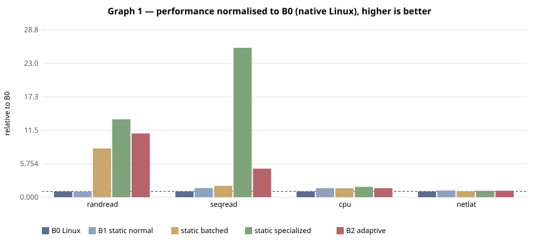
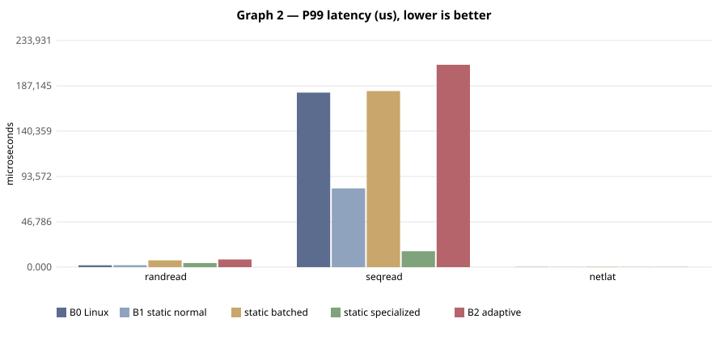

# E-001 — suite `main`

- Date: 2026-09-26T06:30:49Z  commit `unknown-dirty`
- Host: Linux 6.6.87.2-microsoft-standard-WSL2 x86_64 / AMD Ryzen 5 7520U with Radeon Graphics (WSL2 (Hyper-V) host, KVM nested inside WSL2 when accel=kvm)
- QEMU: QEMU emulator version 10.2.1 (Debian 1:10.2.1+ds-1ubuntu3.1)  accel **kvm**
- VM `bench`: 4 vCPU, 4096 MB, 40 GB virtio-blk, qcow2 overlay on ext4 (WSL2 vhdx), cache=none
- Kernel: 6.12.111-0-virt; reps=1, time=5s, warmup=4s

## Static vs adaptive (median of reps; CV% in parentheses)

| workload | metric | B0 Linux | B1 static normal | static batched | static specialized | B2 adaptive | B3 best static | adaptive vs B1 | adaptive vs B3 |
|---|---|---|---|---|---|---|---|---|---|
| randread | IOPS (IOPS) | 1,084 (0%) | 1,041 (0%) | 9,087 (0%) | 14,529 (0%) | 11,884 (0%) | 14,529 (specialized) | +1041.1% | -18.2% |
| seqread | MB/s (MB/s) | 25.6 (0%) | 40.6 (0%) | 49.9 (0%) | 658.0 (0%) | 125.9 (0%) | 658.0 (specialized) | +209.8% | -80.9% |
| cpu | Mops/s (Mops/s) | 1,114 (0%) | 1,750 (0%) | 1,721 (0%) | 1,984 (0%) | 1,732 (0%) | 1,984 (specialized) | -1.0% | -12.7% |
| netlat | RTT p50 (us) | 26.9 (0%) | 23.2 (0%) | 26.1 (0%) | 24.4 (0%) | 23.9 (0%) | 23.2 (normal) | -2.9% | -2.9% |

Relative columns: positive = adaptive better. Latency workloads compare inversely.

## Threats to validity (this run)

- Nested virtualisation (Windows Hyper-V → WSL2 → KVM): absolute numbers are not representative of bare metal; only relative comparisons inside one run are meaningful.
- Disk is a qcow2 overlay on a WSL2 virtual disk; host page cache bypassed (cache=none) but the WSL2 vhdx layer is not.
- Network workloads use guest loopback; they exercise the guest stack, not virtio-net.
- Small sample size (reps=1); see CV% for run-to-run variance.
