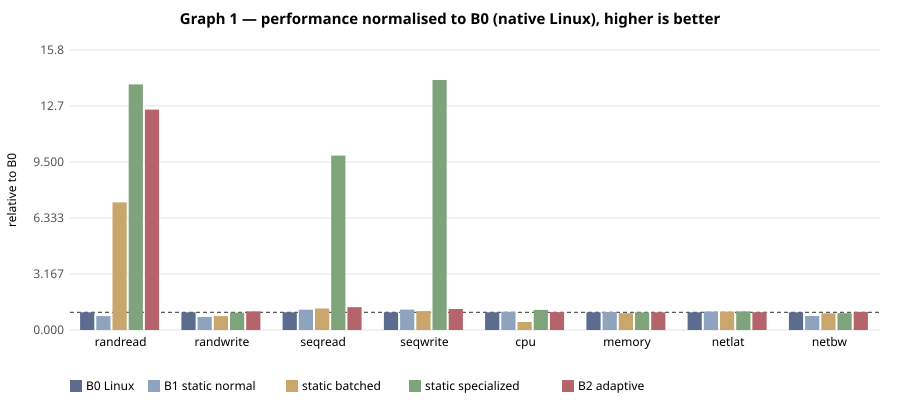
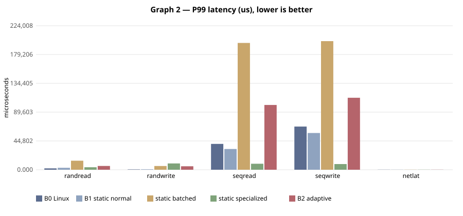
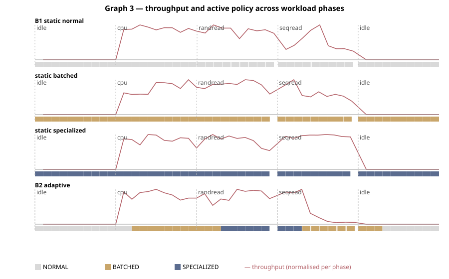
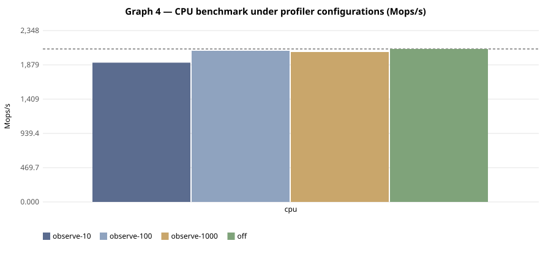

# E-002 — suite `all`

- Date: 2026-09-26T06:52:34Z  commit `d4f167e-dirty`
- Host: Linux 6.6.87.2-microsoft-standard-WSL2 x86_64 / AMD Ryzen 5 7520U with Radeon Graphics (WSL2 (Hyper-V) host, KVM nested inside WSL2 when accel=kvm)
- QEMU: QEMU emulator version 10.2.1 (Debian 1:10.2.1+ds-1ubuntu3.1)  accel **kvm**
- VM `bench`: 4 vCPU, 4096 MB, 40 GB virtio-blk, qcow2 overlay on ext4 (WSL2 vhdx), cache=none
- Kernel: 6.12.111-0-virt; reps=3, time=10s, warmup=5s

## Static vs adaptive (median of reps; CV% in parentheses)

| workload | metric | B0 Linux | B1 static normal | static batched | static specialized | B2 adaptive | B3 best static | adaptive vs B1 | adaptive vs B3 |
|---|---|---|---|---|---|---|---|---|---|
| randread | IOPS (IOPS) | 1,070 (9%) | 842.1 (38%) | 7,721 (40%) | 14,860 (34%) | 13,334 (17%) | 14,860 (specialized) | +1483.3% | -10.3% |
| randwrite | IOPS (IOPS) | 11,892 (28%) | 8,818 (77%) | 9,372 (42%) | 11,653 (37%) | 12,476 (13%) | 11,653 (specialized) | +41.5% | +7.1% |
| seqread | MB/s (MB/s) | 78.6 (41%) | 90.1 (45%) | 95.5 (44%) | 775.4 (33%) | 101.2 (9%) | 775.4 (specialized) | +12.3% | -87.0% |
| seqwrite | MB/s (MB/s) | 62.0 (57%) | 71.4 (37%) | 66.2 (39%) | 876.4 (17%) | 73.5 (13%) | 876.4 (specialized) | +3.1% | -91.6% |
| cpu | Mops/s (Mops/s) | 1,829 (14%) | 1,885 (39%) | 827.8 (94%) | 2,074 (34%) | 1,854 (8%) | 2,074 (specialized) | -1.7% | -10.6% |
| memory | triad GB/s (GB/s) | 12.8 (2%) | 13.0 (37%) | 12.1 (47%) | 12.7 (39%) | 12.8 (5%) | 13.0 (normal) | -1.6% | -1.6% |
| netlat | RTT p50 (us) | 23.6 (3%) | 22.6 (33%) | 22.7 (36%) | 22.5 (38%) | 23.5 (3%) | 22.5 (specialized) | -3.6% | -4.3% |
| netbw | MB/s (MB/s) | 3,121 (8%) | 2,463 (27%) | 2,944 (45%) | 2,967 (33%) | 3,196 (7%) | 2,967 (specialized) | +29.7% | +7.7% |

Relative columns: positive = adaptive better. Latency workloads compare inversely.

### A6 — where does the gain come from? (median; relative to B1 static normal)

| workload | knobs-only batched | knobs-only specialized | lib-only batched | lib-only specialized | full batched | full specialized |
|---|---|---|---|---|---|---|
| randread | 927.6 (+10%) | 984.3 (+17%) | 8,531 (+913%) | 12,291 (+1359%) | 7,721 (+817%) | 14,860 (+1665%) |
| randwrite | 9,031 (+2%) | 11,009 (+25%) | 5,707 (-35%) | 6,933 (-21%) | 9,372 (+6%) | 11,653 (+32%) |
| seqread | 84.7 (-6%) | 77.8 (-14%) | 76.6 (-15%) | 775.1 (+760%) | 95.5 (+6%) | 775.4 (+761%) |
| seqwrite | 75.3 (+5%) | 77.2 (+8%) | 67.7 (-5%) | 682.2 (+856%) | 66.2 (-7%) | 876.4 (+1128%) |
| cpu | 1,954 (+4%) | 1,985 (+5%) | 1,720 (-9%) | 946.8 (-50%) | 827.8 (-56%) | 2,074 (+10%) |
| memory | 11.9 (-9%) | 12.3 (-6%) | 12.4 (-5%) | 6.224 (-52%) | 12.1 (-7%) | 12.7 (-3%) |
| netlat | 25.7 (-12%) | 22.7 (-0%) | 23.2 (-3%) | 30.4 (-26%) | 22.7 (-0%) | 22.5 (+1%) |
| netbw | 2,719 (+10%) | 2,432 (-1%) | 2,986 (+21%) | 2,843 (+15%) | 2,944 (+20%) | 2,967 (+20%) |

## Workload transitions (Graph 3)

| config | rep | switches | time-to-policy randread (s) | seqread (s) | cpu (s) | randread MB/s | seqread MB/s | cpu ops/s |
|---|---|---|---|---|---|---|---|---|
| B1 static normal | 1 | 0 | NOT RUN | NOT RUN | NOT RUN | 1.482 | 78.3 | 735,320,000 |
| B1 static normal | 2 | 0 | NOT RUN | NOT RUN | NOT RUN | 2.219 | 67.0 | 1,166,060,000 |
| B1 static normal | 3 | 0 | NOT RUN | NOT RUN | NOT RUN | 2.867 | 83.5 | 1,533,290,000 |
| static batched | 1 | 0 | NOT RUN | 1.000 | 1.000 | 24.7 | 157.1 | 892,130,000 |
| static batched | 2 | 0 | NOT RUN | 1.000 | 1.000 | 26.5 | 84.7 | 1,538,950,000 |
| static batched | 3 | 0 | NOT RUN | 1.000 | 1.000 | 32.7 | 101.9 | 1,347,310,000 |
| static specialized | 1 | 0 | 1.000 | NOT RUN | NOT RUN | 28.8 | 1,025 | 1,168,770,000 |
| static specialized | 2 | 0 | 1.000 | NOT RUN | NOT RUN | 50.5 | 1,282 | 1,497,860,000 |
| static specialized | 3 | 0 | 1.000 | NOT RUN | NOT RUN | 53.4 | 1,148 | 2,038,640,000 |
| B2 adaptive | 1 | 4 | 4.010 | 4.070 | 3.000 | 23.1 | 408.9 | 1,164,640,000 |
| B2 adaptive | 2 | 5 | 3.010 | 4.040 | 3.000 | 34.7 | 423.7 | 1,511,360,000 |
| B2 adaptive | 3 | 5 | 4.020 | 4.060 | 3.000 | 36.0 | 400.5 | 1,496,800,000 |

Time-to-policy counts from the phase start until fuhrerd's published policy equals the policy the default map assigns to that phase; NOT RUN = never reached (expected for static configs).

## Monitoring overhead (Graph 4; A1 off vs A2 observe at several intervals)

| variant | cpu Mops/s median | vs off | fuhrerd self CPU % (of all vCPUs) |
|---|---|---|---|
| observe-10 | 1,909 | -8.96% | 5.065 |
| observe-100 | 2,071 | -1.22% | 0.686 |
| observe-1000 | 2,055 | -1.99% | 0.087 |
| off | 2,097 | +0.00% | 0.000 |

## Adaptation ablations (A4 default, A5 sampling interval, A7 hysteresis)

| variant | reps | switches (median) | time-to-policy randread (s) | time-to-policy seqread (s) | randread MB/s | seqread MB/s |
|---|---|---|---|---|---|---|
| adaptive-default | 3 | 2.000 | 3.020 | 1.000 | 40.0 | 915.9 |
| hyst-1 | 3 | 2.000 | 1.000 | 1.000 | 51.8 | 889.9 |
| hyst-5 | 3 | 2.000 | 5.060 | 1.000 | 30.6 | 962.6 |
| interval-100 | 3 | 2.000 | 1.000 | 1.000 | 57.0 | 1,021 |
| interval-5000 | 3 | 0.000 | NOT RUN | 2.010 | 4.571 | 194.5 |

## Threats to validity (this run)

- Nested virtualisation (Windows Hyper-V → WSL2 → KVM): absolute numbers are not representative of bare metal; only relative comparisons inside one run are meaningful.
- Disk is a qcow2 overlay on a WSL2 virtual disk; host page cache bypassed (cache=none) but the WSL2 vhdx layer is not.
- Network workloads use guest loopback; they exercise the guest stack, not virtio-net.
- Small sample size (reps=3); see CV% for run-to-run variance.
