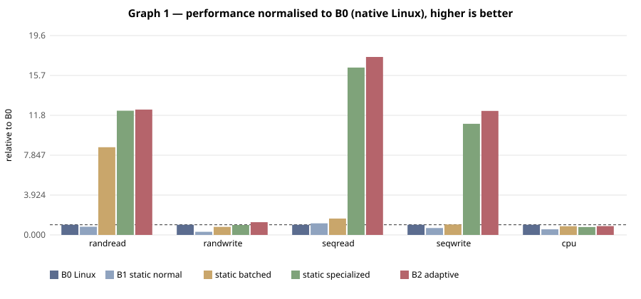
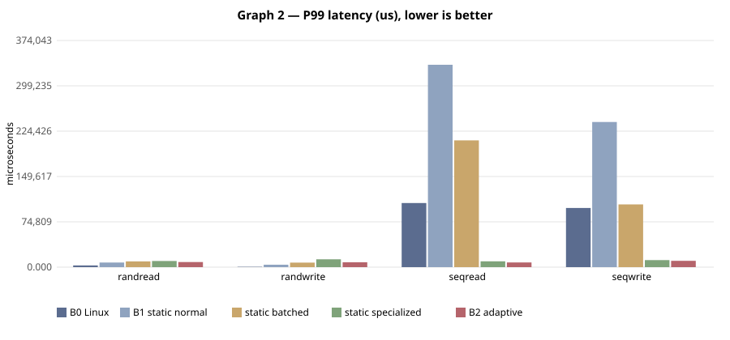

# E-003 — suite `main`

- Date: 2026-09-26T08:45:31Z  commit `d4f167e-dirty`
- Host: Linux 6.6.87.2-microsoft-standard-WSL2 x86_64 / AMD Ryzen 5 7520U with Radeon Graphics (WSL2 (Hyper-V) host, KVM nested inside WSL2 when accel=kvm)
- QEMU: QEMU emulator version 10.2.1 (Debian 1:10.2.1+ds-1ubuntu3.1)  accel **kvm**
- VM `bench`: 4 vCPU, 4096 MB, 40 GB virtio-blk, qcow2 overlay on ext4 (WSL2 vhdx), cache=none
- Kernel: 6.12.111-0-virt; reps=3, time=10s, warmup=5s

## Static vs adaptive (median of reps; CV% in parentheses)

| workload | metric | B0 Linux | B1 static normal | static batched | static specialized | B2 adaptive | B3 best static | adaptive vs B1 | adaptive vs B3 |
|---|---|---|---|---|---|---|---|---|---|
| randread | IOPS (IOPS) | 903.0 (28%) | 729.6 (55%) | 7,794 (12%) | 11,040 (8%) | 11,144 (8%) | 11,040 (specialized) | +1427.4% | +0.9% |
| randwrite | IOPS (IOPS) | 8,672 (20%) | 2,683 (37%) | 6,875 (17%) | 8,501 (22%) | 10,862 (24%) | 8,501 (specialized) | +304.9% | +27.8% |
| seqread | MB/s (MB/s) | 46.7 (60%) | 53.2 (109%) | 75.1 (38%) | 768.7 (3%) | 817.4 (2%) | 768.7 (specialized) | +1437.4% | +6.3% |
| seqwrite | MB/s (MB/s) | 65.7 (27%) | 44.8 (69%) | 67.9 (14%) | 718.9 (8%) | 802.2 (9%) | 718.9 (specialized) | +1690.8% | +11.6% |
| cpu | Mops/s (Mops/s) | 1,966 (1%) | 1,093 (40%) | 1,677 (28%) | 1,529 (17%) | 1,714 (19%) | 1,677 (batched) | +56.8% | +2.2% |

Relative columns: positive = adaptive better. Latency workloads compare inversely.

### A6 — where does the gain come from? (median; relative to B1 static normal)

| workload | knobs-only batched | knobs-only specialized | lib-only batched | lib-only specialized | full batched | full specialized |
|---|---|---|---|---|---|---|
| randread | 807.6 (+11%) | 718.4 (-2%) | 8,339 (+1043%) | 10,528 (+1343%) | 7,794 (+968%) | 11,040 (+1413%) |
| randwrite | 5,948 (+122%) | 10,671 (+298%) | 7,889 (+194%) | 10,657 (+297%) | 6,875 (+156%) | 8,501 (+217%) |
| seqread | 58.6 (+10%) | 50.7 (-5%) | 76.2 (+43%) | 835.9 (+1472%) | 75.1 (+41%) | 768.7 (+1346%) |
| seqwrite | 42.4 (-5%) | 55.7 (+24%) | 63.3 (+41%) | 810.7 (+1710%) | 67.9 (+52%) | 718.9 (+1505%) |
| cpu | 1,359 (+24%) | 1,355 (+24%) | 1,631 (+49%) | 1,707 (+56%) | 1,677 (+53%) | 1,529 (+40%) |

## Threats to validity (this run)

- Nested virtualisation (Windows Hyper-V → WSL2 → KVM): absolute numbers are not representative of bare metal; only relative comparisons inside one run are meaningful.
- Disk is a qcow2 overlay on a WSL2 virtual disk; host page cache bypassed (cache=none) but the WSL2 vhdx layer is not.
- Network workloads use guest loopback; they exercise the guest stack, not virtio-net.
- Small sample size (reps=3); see CV% for run-to-run variance.
