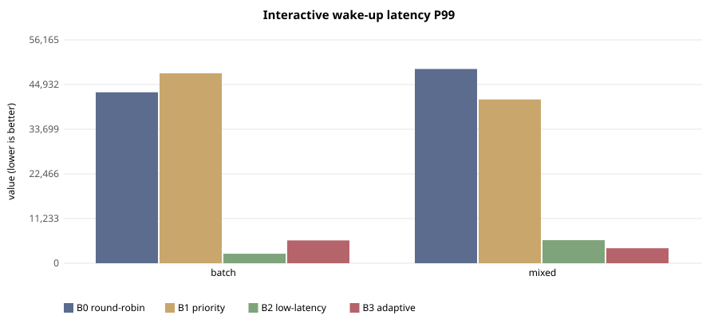
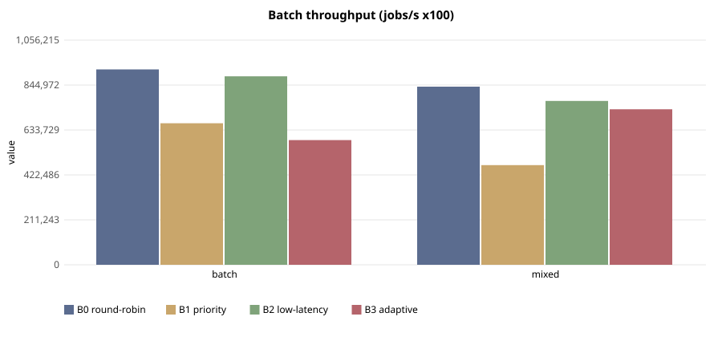

# E-101 — suite `sched`

- Date 2026-09-26T14:52:45Z, commit `3facef8-dirty`, kernel FuhrerOS 0.1.0 (own kernel)
- Host Linux 6.6.87.2-microsoft-standard-WSL2 x86_64 / AMD Ryzen 5 7520U with Radeon Graphics (Windows 11 -> WSL2 -> QEMU; KVM nested inside WSL2 when accel=kvm)
- QEMU emulator version 10.2.1 (Debian 1:10.2.1+ds-1ubuntu3.1), accel **kvm**, 4 vCPU offered (FuhrerOS uses 1), 4096 MB
- virtio-blk, FFS0 raw image, host cache=writeback; virtio-net, QEMU user-mode (slirp)

## Scheduler — scenario `batch` (median of 3 runs; CV%)

| metric | B0 round-robin | B1 priority | B2 low-latency | B3 adaptive |
|---|---|---|---|---|
| wake p50 (us) | 40,084 (0%) | 40,092 (0%) | 966 (2%) | 950 (2%) |
| wake p99 (us) | 42,979 (17%) | 47,763 (41%) | 2,383 (42%) | 5,742 (69%) |
| response p99 (us) | 53,019 (14%) | 57,837 (35%) | 14,482 (8%) | 15,815 (26%) |
| batch jobs/s (x100) | 918,448 (34%) | 665,375 (37%) | 886,064 (32%) | 586,265 (35%) |
| I/O ops/s | 0 (0%) | 0 (0%) | 0 (0%) | 0 (0%) |
| fairness (Jain x1000) | 999 (0%) | 999 (0%) | 999 (0%) | 999 (0%) |
| ctx switches/s | 144 (0%) | 142 (8%) | 773 (0%) | 313 (4%) |
| sched overhead ns/s | 75,143 (61%) | 68,015 (56%) | 226,598 (23%) | 115,760 (92%) |
| system class (mid-run) | IDLE | IDLE | IDLE | IDLE |

## Scheduler — scenario `mixed` (median of 3 runs; CV%)

| metric | B0 round-robin | B1 priority | B2 low-latency | B3 adaptive |
|---|---|---|---|---|
| wake p50 (us) | 30,040 (0%) | 30,063 (20%) | 962 (2%) | 964 (2%) |
| wake p99 (us) | 48,839 (17%) | 41,188 (152%) | 5,794 (70%) | 3,777 (91%) |
| response p99 (us) | 60,600 (14%) | 51,227 (147%) | 16,097 (31%) | 15,286 (19%) |
| batch jobs/s (x100) | 837,465 (32%) | 468,540 (74%) | 770,449 (36%) | 730,901 (33%) |
| I/O ops/s | 21 (3%) | 21 (59%) | 461 (5%) | 488 (6%) |
| fairness (Jain x1000) | 999 (0%) | 999 (0%) | 999 (0%) | 999 (0%) |
| ctx switches/s | 185 (1%) | 184 (51%) | 1,802 (4%) | 1,728 (5%) |
| sched overhead ns/s | 58,153 (79%) | 69,922 (21%) | 400,091 (42%) | 826,326 (64%) |
| system class (mid-run) | IDLE | IDLE | IDLE | IDLE |

## Threats to validity

- Nested virtualisation (Windows → WSL2 → KVM): absolute times are not bare-metal times; comparisons are between policies within one boot.
- FuhrerOS schedules on one CPU (the BSP); extra vCPUs offered by QEMU are idle.
- Small repetition counts; see CV%.
