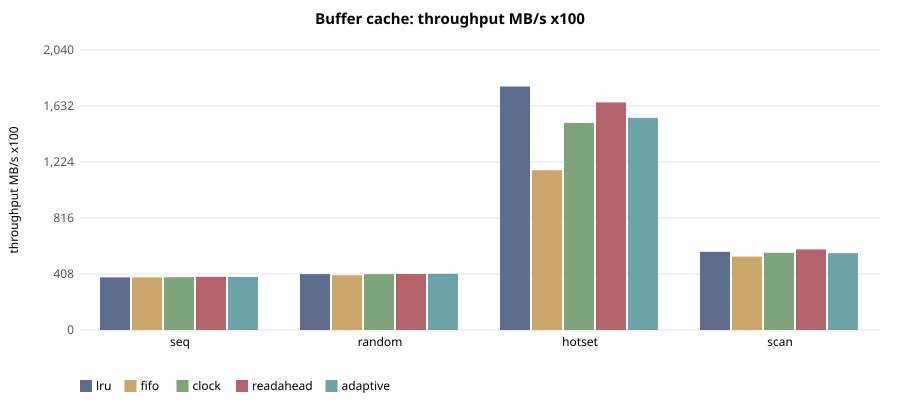
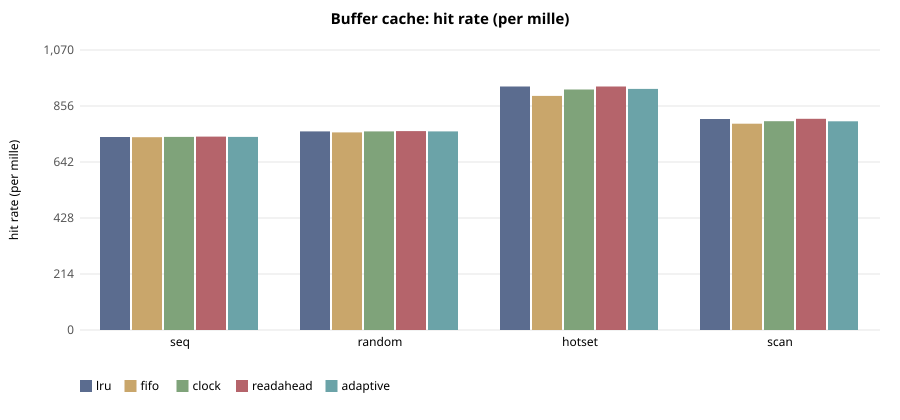

# E-102 — suite `cache`

- Date 2026-09-26T14:58:36Z, commit `3facef8-dirty`, kernel FuhrerOS 0.1.0 (own kernel)
- Host Linux 6.6.87.2-microsoft-standard-WSL2 x86_64 / AMD Ryzen 5 7520U with Radeon Graphics (Windows 11 -> WSL2 -> QEMU; KVM nested inside WSL2 when accel=kvm)
- QEMU emulator version 10.2.1 (Debian 1:10.2.1+ds-1ubuntu3.1), accel **kvm**, 4 vCPU offered (FuhrerOS uses 1), 4096 MB
- virtio-blk, FFS0 raw image, host cache=writeback; virtio-net, QEMU user-mode (slirp)

## Buffer cache — throughput MB/s x100 (median)

| workload | lru | fifo | clock | readahead | adaptive |
|---|---|---|---|---|---|
| seq | 384 | 383 | 384 | 388 | 386 |
| random | 407 | 400 | 406 | 408 | 410 |
| hotset | 1,774 | 1,164 | 1,508 | 1,658 | 1,546 |
| scan | 570 | 535 | 562 | 587 | 560 |

## Buffer cache — hit rate (per mille) (median)

| workload | lru | fifo | clock | readahead | adaptive |
|---|---|---|---|---|---|
| seq | 738 | 737 | 738 | 739 | 738 |
| random | 759 | 755 | 759 | 760 | 759 |
| hotset | 930 | 894 | 919 | 930 | 922 |
| scan | 806 | 788 | 798 | 807 | 798 |

## Buffer cache — read latency p99 (us) (median)

| workload | lru | fifo | clock | readahead | adaptive |
|---|---|---|---|---|---|
| seq | 1,597 | 1,751 | 1,487 | 1,398 | 1,250 |
| random | 1,564 | 2,020 | 1,555 | 1,604 | 1,374 |
| hotset | 1,089 | 1,170 | 1,120 | 1,312 | 1,128 |
| scan | 1,631 | 1,271 | 1,160 | 1,153 | 1,176 |

## Buffer cache — cache CPU (us) (median)

| workload | lru | fifo | clock | readahead | adaptive |
|---|---|---|---|---|---|
| seq | 10,816 | 14,212 | 9,734 | 10,476 | 9,797 |
| random | 13,670 | 14,246 | 12,248 | 41,382 | 10,892 |
| hotset | 22,932 | 15,355 | 19,714 | 60,476 | 22,698 |
| scan | 15,570 | 13,934 | 12,392 | 32,744 | 11,997 |

## Threats to validity

- Nested virtualisation (Windows → WSL2 → KVM): absolute times are not bare-metal times; comparisons are between policies within one boot.
- FuhrerOS schedules on one CPU (the BSP); extra vCPUs offered by QEMU are idle.
- Small repetition counts; see CV%.
