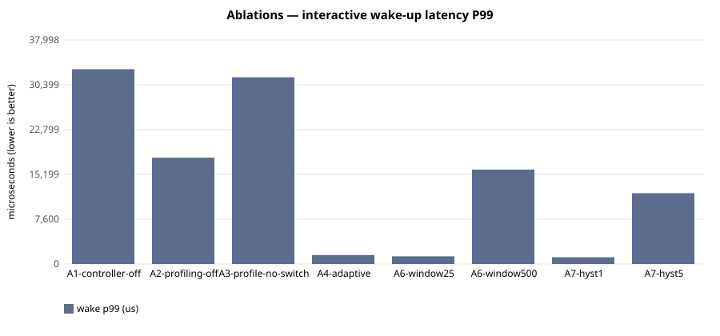

# E-104 — suite `ablation`

- Date 2026-09-26T15:06:01Z, commit `3facef8-dirty`, kernel FuhrerOS 0.1.0 (own kernel)
- Host Linux 6.6.87.2-microsoft-standard-WSL2 x86_64 / AMD Ryzen 5 7520U with Radeon Graphics (Windows 11 -> WSL2 -> QEMU; KVM nested inside WSL2 when accel=kvm)
- QEMU emulator version 10.2.1 (Debian 1:10.2.1+ds-1ubuntu3.1), accel **kvm**, 4 vCPU offered (FuhrerOS uses 1), 4096 MB
- virtio-blk, FFS0 raw image, host cache=writeback; virtio-net, QEMU user-mode (slirp)

## Scheduler — scenario `A1-controller-off` (median of 3 runs; CV%)

| metric | B1 priority |
|---|---|
| wake p50 (us) | 30,042 (0%) |
| wake p99 (us) | 33,042 (10%) |
| response p99 (us) | 43,087 (8%) |
| batch jobs/s (x100) | 885,163 (11%) |
| I/O ops/s | 21 (3%) |
| fairness (Jain x1000) | 999 (0%) |
| ctx switches/s | 187 (0%) |
| sched overhead ns/s | 87,766 (70%) |
| system class (mid-run) | IDLE |

## Scheduler — scenario `A2-profiling-off` (median of 3 runs; CV%)

| metric | B3 adaptive |
|---|---|
| wake p50 (us) | 12,023 (0%) |
| wake p99 (us) | 18,037 (3%) |
| response p99 (us) | 28,085 (2%) |
| batch jobs/s (x100) | 938,722 (7%) |
| I/O ops/s | 45 (1%) |
| fairness (Jain x1000) | 999 (0%) |
| ctx switches/s | 423 (0%) |
| sched overhead ns/s | 94,747 (12%) |
| system class (mid-run) | IDLE |

## Scheduler — scenario `A3-profile-no-switch` (median of 3 runs; CV%)

| metric | B0 round-robin |
|---|---|
| wake p50 (us) | 30,041 (0%) |
| wake p99 (us) | 31,674 (19%) |
| response p99 (us) | 41,728 (15%) |
| batch jobs/s (x100) | 824,419 (8%) |
| I/O ops/s | 21 (0%) |
| fairness (Jain x1000) | 999 (0%) |
| ctx switches/s | 188 (1%) |
| sched overhead ns/s | 38,318 (127%) |
| system class (mid-run) | IDLE |

## Scheduler — scenario `A4-adaptive` (median of 3 runs; CV%)

| metric | B3 adaptive |
|---|---|
| wake p50 (us) | 979 (0%) |
| wake p99 (us) | 1,526 (3%) |
| response p99 (us) | 11,564 (0%) |
| batch jobs/s (x100) | 893,841 (4%) |
| I/O ops/s | 499 (0%) |
| fairness (Jain x1000) | 999 (0%) |
| ctx switches/s | 1,761 (0%) |
| sched overhead ns/s | 167,413 (12%) |
| system class (mid-run) | IDLE |

## Scheduler — scenario `A6-window25` (median of 3 runs; CV%)

| metric | B3 adaptive |
|---|---|
| wake p50 (us) | 983 (152%) |
| wake p99 (us) | 1,309 (147%) |
| response p99 (us) | 11,411 (67%) |
| batch jobs/s (x100) | 959,733 (7%) |
| I/O ops/s | 503 (80%) |
| fairness (Jain x1000) | 999 (0%) |
| ctx switches/s | 1,772 (71%) |
| sched overhead ns/s | 115,334 (60%) |
| system class (mid-run) | IDLE |

## Scheduler — scenario `A6-window500` (median of 3 runs; CV%)

| metric | B3 adaptive |
|---|---|
| wake p50 (us) | 980 (0%) |
| wake p99 (us) | 16,019 (27%) |
| response p99 (us) | 26,059 (17%) |
| batch jobs/s (x100) | 942,176 (9%) |
| I/O ops/s | 467 (2%) |
| fairness (Jain x1000) | 999 (0%) |
| ctx switches/s | 1,663 (2%) |
| sched overhead ns/s | 150,453 (23%) |
| system class (mid-run) | IDLE |

## Scheduler — scenario `A7-hyst1` (median of 3 runs; CV%)

| metric | B3 adaptive |
|---|---|
| wake p50 (us) | 982 (0%) |
| wake p99 (us) | 1,144 (12%) |
| response p99 (us) | 11,191 (1%) |
| batch jobs/s (x100) | 949,750 (8%) |
| I/O ops/s | 505 (0%) |
| fairness (Jain x1000) | 999 (7%) |
| ctx switches/s | 1,788 (1%) |
| sched overhead ns/s | 130,491 (39%) |
| system class (mid-run) | IDLE |

## Scheduler — scenario `A7-hyst5` (median of 3 runs; CV%)

| metric | B3 adaptive |
|---|---|
| wake p50 (us) | 975 (0%) |
| wake p99 (us) | 12,004 (5%) |
| response p99 (us) | 22,060 (3%) |
| batch jobs/s (x100) | 829,680 (22%) |
| I/O ops/s | 482 (9%) |
| fairness (Jain x1000) | 999 (0%) |
| ctx switches/s | 1,713 (8%) |
| sched overhead ns/s | 222,467 (99%) |
| system class (mid-run) | IDLE |

## Threats to validity

- Nested virtualisation (Windows → WSL2 → KVM): absolute times are not bare-metal times; comparisons are between policies within one boot.
- FuhrerOS schedules on one CPU (the BSP); extra vCPUs offered by QEMU are idle.
- Small repetition counts; see CV%.
