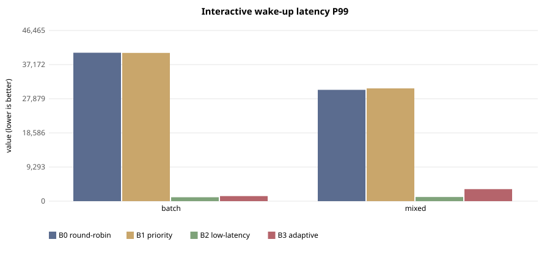
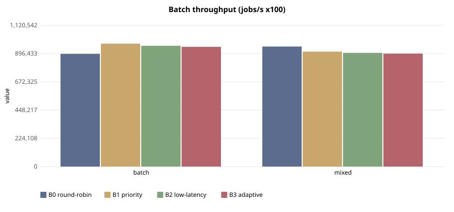

# E-105 — suite `sched`

- Date 2026-09-26T15:13:57Z, commit `32d80f9-dirty`, kernel FuhrerOS 0.1.0 (own kernel)
- Host Linux 6.6.87.2-microsoft-standard-WSL2 x86_64 / AMD Ryzen 5 7520U with Radeon Graphics (Windows 11 -> WSL2 -> QEMU; KVM nested inside WSL2 when accel=kvm)
- QEMU emulator version 10.2.1 (Debian 1:10.2.1+ds-1ubuntu3.1), accel **kvm**, 4 vCPU offered (FuhrerOS uses 1), 4096 MB
- virtio-blk, FFS0 raw image, host cache=writeback; virtio-net, QEMU user-mode (slirp)

## Scheduler — scenario `batch` (median of 5 runs; CV%)

| metric | B0 round-robin | B1 priority | B2 low-latency | B3 adaptive |
|---|---|---|---|---|
| wake p50 (us) | 30,288 (2%) | 30,282 (13%) | 42 (40%) | 44 (6%) |
| wake p99 (us) | 40,404 (8%) | 40,361 (7%) | 1,060 (61%) | 1,379 (39%) |
| response p99 (us) | 50,479 (6%) | 50,400 (5%) | 11,111 (8%) | 11,419 (5%) |
| batch jobs/s (x100) | 893,792 (11%) | 974,384 (15%) | 957,676 (7%) | 949,592 (3%) |
| I/O ops/s | 0 (0%) | 0 (0%) | 0 (0%) | 0 (0%) |
| fairness (Jain x1000) | 999 (0%) | 999 (0%) | 999 (0%) | 999 (0%) |
| ctx switches/s | 150 (1%) | 151 (2%) | 789 (1%) | 342 (2%) |
| sched overhead ns/s | 30,347 (23%) | 22,175 (84%) | 82,524 (105%) | 42,316 (21%) |
| system class (mid-run) | CPU_BOUND | CPU_BOUND | CPU_BOUND | CPU_BOUND |

Per-worker classes assigned by the kernel at mid-run:

- B0 round-robin: `cpu:CPU_BOUND,cpu:CPU_BOUND,cpu:CPU_BOUND,cpu:CPU_BOUND,probe:INTERACTIVE`
- B1 priority: `cpu:CPU_BOUND,cpu:CPU_BOUND,cpu:CPU_BOUND,cpu:CPU_BOUND,probe:INTERACTIVE`
- B2 low-latency: `cpu:CPU_BOUND,cpu:CPU_BOUND,cpu:CPU_BOUND,cpu:CPU_BOUND,probe:INTERACTIVE`
- B3 adaptive: `cpu:CPU_BOUND,cpu:CPU_BOUND,cpu:CPU_BOUND,cpu:CPU_BOUND,probe:INTERACTIVE`

## Scheduler — scenario `mixed` (median of 5 runs; CV%)

| metric | B0 round-robin | B1 priority | B2 low-latency | B3 adaptive |
|---|---|---|---|---|
| wake p50 (us) | 20,205 (0%) | 20,206 (0%) | 43 (3%) | 44 (72%) |
| wake p99 (us) | 30,294 (3%) | 30,704 (2%) | 1,132 (7%) | 3,268 (97%) |
| response p99 (us) | 40,334 (2%) | 40,791 (1%) | 11,179 (1%) | 13,615 (26%) |
| batch jobs/s (x100) | 951,683 (7%) | 911,100 (5%) | 901,629 (3%) | 895,648 (12%) |
| I/O ops/s | 21 (3%) | 21 (3%) | 513 (1%) | 503 (3%) |
| fairness (Jain x1000) | 999 (0%) | 999 (0%) | 999 (0%) | 999 (0%) |
| ctx switches/s | 199 (1%) | 198 (1%) | 1,951 (1%) | 1,788 (3%) |
| sched overhead ns/s | 25,163 (15%) | 21,843 (17%) | 126,314 (15%) | 311,582 (93%) |
| system class (mid-run) | CPU_BOUND | CPU_BOUND | IO_BOUND | IO_BOUND |

Per-worker classes assigned by the kernel at mid-run:

- B0 round-robin: `cpu:CPU_BOUND,cpu:CPU_BOUND,cpu:CPU_BOUND,io:INTERACTIVE,probe:INTERACTIVE`
- B1 priority: `cpu:CPU_BOUND,cpu:CPU_BOUND,cpu:CPU_BOUND,io:INTERACTIVE,probe:INTERACTIVE`
- B2 low-latency: `cpu:CPU_BOUND,cpu:CPU_BOUND,cpu:CPU_BOUND,io:IO_BOUND,probe:INTERACTIVE`
- B3 adaptive: `cpu:CPU_BOUND,cpu:CPU_BOUND,cpu:CPU_BOUND,io:IO_BOUND,probe:INTERACTIVE`

## Threats to validity

- Nested virtualisation (Windows → WSL2 → KVM): absolute times are not bare-metal times; comparisons are between policies within one boot.
- FuhrerOS schedules on one CPU (the BSP); extra vCPUs offered by QEMU are idle.
- Small repetition counts; see CV%.
