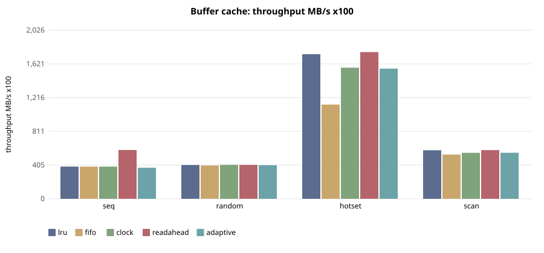
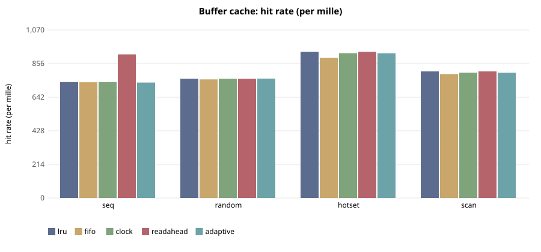

# E-106 — suite `cache`

- Date 2026-09-26T15:21:29Z, commit `ba10d0c-dirty`, kernel FuhrerOS 0.1.0 (own kernel)
- Host Linux 6.6.87.2-microsoft-standard-WSL2 x86_64 / AMD Ryzen 5 7520U with Radeon Graphics (Windows 11 -> WSL2 -> QEMU; KVM nested inside WSL2 when accel=kvm)
- QEMU emulator version 10.2.1 (Debian 1:10.2.1+ds-1ubuntu3.1), accel **kvm**, 4 vCPU offered (FuhrerOS uses 1), 4096 MB
- virtio-blk, FFS0 raw image, host cache=writeback; virtio-net, QEMU user-mode (slirp)

## Buffer cache — throughput MB/s x100 (median)

| workload | lru | fifo | clock | readahead | adaptive |
|---|---|---|---|---|---|
| seq | 387 | 386 | 386 | 586 | 372 |
| random | 406 | 400 | 408 | 408 | 404 |
| hotset | 1,737 | 1,132 | 1,574 | 1,762 | 1,564 |
| scan | 584 | 532 | 552 | 585 | 553 |

## Buffer cache — hit rate (per mille) (median)

| workload | lru | fifo | clock | readahead | adaptive |
|---|---|---|---|---|---|
| seq | 738 | 737 | 738 | 914 | 735 |
| random | 759 | 755 | 759 | 758 | 760 |
| hotset | 930 | 892 | 922 | 930 | 921 |
| scan | 806 | 789 | 798 | 806 | 798 |

## Buffer cache — read latency p99 (us) (median)

| workload | lru | fifo | clock | readahead | adaptive |
|---|---|---|---|---|---|
| seq | 1,233 | 1,219 | 1,286 | 1,339 | 3,032 |
| random | 1,280 | 2,008 | 1,360 | 1,382 | 1,630 |
| hotset | 1,098 | 1,236 | 1,072 | 1,066 | 1,076 |
| scan | 1,204 | 1,530 | 1,384 | 1,138 | 1,352 |

## Buffer cache — cache CPU (us) (median)

| workload | lru | fifo | clock | readahead | adaptive |
|---|---|---|---|---|---|
| seq | 6,442 | 7,399 | 8,058 | 940,766 | 417,454 |
| random | 13,984 | 14,582 | 9,718 | 10,020 | 13,546 |
| hotset | 22,788 | 18,932 | 13,790 | 19,258 | 15,101 |
| scan | 12,230 | 14,186 | 15,340 | 12,811 | 14,015 |

## Threats to validity

- Nested virtualisation (Windows → WSL2 → KVM): absolute times are not bare-metal times; comparisons are between policies within one boot.
- FuhrerOS schedules on one CPU (the BSP); extra vCPUs offered by QEMU are idle.
- Small repetition counts; see CV%.
