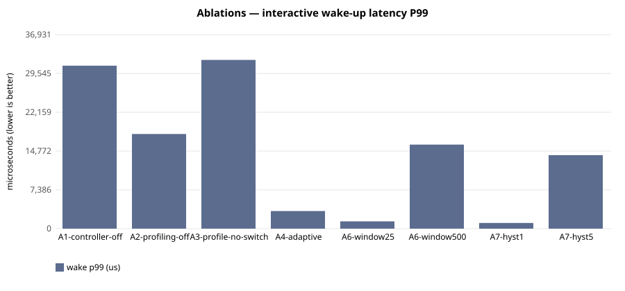

# E-108 — suite `ablation`

- Date 2026-09-26T15:28:42Z, commit `ba10d0c-dirty`, kernel FuhrerOS 0.1.0 (own kernel)
- Host Linux 6.6.87.2-microsoft-standard-WSL2 x86_64 / AMD Ryzen 5 7520U with Radeon Graphics (Windows 11 -> WSL2 -> QEMU; KVM nested inside WSL2 when accel=kvm)
- QEMU emulator version 10.2.1 (Debian 1:10.2.1+ds-1ubuntu3.1), accel **kvm**, 4 vCPU offered (FuhrerOS uses 1), 4096 MB
- virtio-blk, FFS0 raw image, host cache=writeback; virtio-net, QEMU user-mode (slirp)

## Scheduler — scenario `A1-controller-off` (median of 3 runs; CV%)

| metric | B1 priority |
|---|---|
| wake p50 (us) | 30,025 (0%) |
| wake p99 (us) | 31,024 (5%) |
| response p99 (us) | 41,063 (3%) |
| batch jobs/s (x100) | 962,939 (4%) |
| I/O ops/s | 21 (0%) |
| fairness (Jain x1000) | 999 (0%) |
| ctx switches/s | 188 (0%) |
| sched overhead ns/s | 41,607 (59%) |
| system class (mid-run) | CPU_BOUND |

Per-worker classes assigned by the kernel at mid-run:

- B1 priority: `cpu:CPU_BOUND,cpu:CPU_BOUND,cpu:CPU_BOUND,io:INTERACTIVE,probe:INTERACTIVE`

## Scheduler — scenario `A2-profiling-off` (median of 3 runs; CV%)

| metric | B3 adaptive |
|---|---|
| wake p50 (us) | 12,006 (0%) |
| wake p99 (us) | 18,019 (3%) |
| response p99 (us) | 28,068 (2%) |
| batch jobs/s (x100) | 947,572 (2%) |
| I/O ops/s | 45 (1%) |
| fairness (Jain x1000) | 998 (0%) |
| ctx switches/s | 424 (1%) |
| sched overhead ns/s | 63,447 (12%) |
| system class (mid-run) | IDLE |

Per-worker classes assigned by the kernel at mid-run:

- B3 adaptive: `cpu:UNKNOWN,cpu:UNKNOWN,cpu:UNKNOWN,io:UNKNOWN,probe:UNKNOWN`

## Scheduler — scenario `A3-profile-no-switch` (median of 3 runs; CV%)

| metric | B0 round-robin |
|---|---|
| wake p50 (us) | 30,025 (0%) |
| wake p99 (us) | 32,114 (5%) |
| response p99 (us) | 42,348 (4%) |
| batch jobs/s (x100) | 917,422 (3%) |
| I/O ops/s | 22 (3%) |
| fairness (Jain x1000) | 999 (0%) |
| ctx switches/s | 188 (1%) |
| sched overhead ns/s | 140,716 (73%) |
| system class (mid-run) | CPU_BOUND |

Per-worker classes assigned by the kernel at mid-run:

- B0 round-robin: `cpu:CPU_BOUND,cpu:CPU_BOUND,cpu:CPU_BOUND,io:INTERACTIVE,probe:INTERACTIVE`

## Scheduler — scenario `A4-adaptive` (median of 3 runs; CV%)

| metric | B3 adaptive |
|---|---|
| wake p50 (us) | 975 (0%) |
| wake p99 (us) | 3,354 (56%) |
| response p99 (us) | 15,650 (17%) |
| batch jobs/s (x100) | 868,784 (5%) |
| I/O ops/s | 491 (1%) |
| fairness (Jain x1000) | 999 (0%) |
| ctx switches/s | 1,726 (1%) |
| sched overhead ns/s | 272,478 (37%) |
| system class (mid-run) | IO_BOUND |

Per-worker classes assigned by the kernel at mid-run:

- B3 adaptive: `cpu:CPU_BOUND,cpu:CPU_BOUND,cpu:CPU_BOUND,io:IO_BOUND,probe:INTERACTIVE`

## Scheduler — scenario `A6-window25` (median of 3 runs; CV%)

| metric | B3 adaptive |
|---|---|
| wake p50 (us) | 976 (0%) |
| wake p99 (us) | 1,381 (62%) |
| response p99 (us) | 11,497 (17%) |
| batch jobs/s (x100) | 923,406 (9%) |
| I/O ops/s | 505 (2%) |
| fairness (Jain x1000) | 999 (0%) |
| ctx switches/s | 1,784 (2%) |
| sched overhead ns/s | 221,043 (39%) |
| system class (mid-run) | IO_BOUND |

Per-worker classes assigned by the kernel at mid-run:

- B3 adaptive: `cpu:CPU_BOUND,cpu:CPU_BOUND,cpu:CPU_BOUND,io:IO_BOUND,probe:INTERACTIVE` | `cpu:CPU_BOUND,cpu:IDLE,cpu:IDLE,io:IO_BOUND,probe:INTERACTIVE`

## Scheduler — scenario `A6-window500` (median of 3 runs; CV%)

| metric | B3 adaptive |
|---|---|
| wake p50 (us) | 978 (0%) |
| wake p99 (us) | 16,001 (13%) |
| response p99 (us) | 26,040 (8%) |
| batch jobs/s (x100) | 919,643 (5%) |
| I/O ops/s | 459 (3%) |
| fairness (Jain x1000) | 999 (0%) |
| ctx switches/s | 1,651 (2%) |
| sched overhead ns/s | 242,145 (43%) |
| system class (mid-run) | IO_BOUND |

Per-worker classes assigned by the kernel at mid-run:

- B3 adaptive: `cpu:CPU_BOUND,cpu:CPU_BOUND,cpu:CPU_BOUND,io:IO_BOUND,probe:INTERACTIVE`

## Scheduler — scenario `A7-hyst1` (median of 3 runs; CV%)

| metric | B3 adaptive |
|---|---|
| wake p50 (us) | 976 (0%) |
| wake p99 (us) | 1,075 (10%) |
| response p99 (us) | 11,142 (1%) |
| batch jobs/s (x100) | 949,208 (2%) |
| I/O ops/s | 506 (0%) |
| fairness (Jain x1000) | 999 (0%) |
| ctx switches/s | 1,776 (0%) |
| sched overhead ns/s | 131,564 (12%) |
| system class (mid-run) | IO_BOUND |

Per-worker classes assigned by the kernel at mid-run:

- B3 adaptive: `cpu:CPU_BOUND,cpu:CPU_BOUND,cpu:CPU_BOUND,io:IO_BOUND,probe:INTERACTIVE`

## Scheduler — scenario `A7-hyst5` (median of 3 runs; CV%)

| metric | B3 adaptive |
|---|---|
| wake p50 (us) | 976 (0%) |
| wake p99 (us) | 13,995 (30%) |
| response p99 (us) | 24,033 (19%) |
| batch jobs/s (x100) | 900,036 (4%) |
| I/O ops/s | 483 (1%) |
| fairness (Jain x1000) | 999 (0%) |
| ctx switches/s | 1,716 (1%) |
| sched overhead ns/s | 185,092 (34%) |
| system class (mid-run) | IO_BOUND |

Per-worker classes assigned by the kernel at mid-run:

- B3 adaptive: `cpu:CPU_BOUND,cpu:CPU_BOUND,cpu:CPU_BOUND,io:IO_BOUND,probe:INTERACTIVE`

## Threats to validity

- Nested virtualisation (Windows → WSL2 → KVM): absolute times are not bare-metal times; comparisons are between policies within one boot.
- FuhrerOS schedules on one CPU (the BSP); extra vCPUs offered by QEMU are idle.
- Small repetition counts; see CV%.
