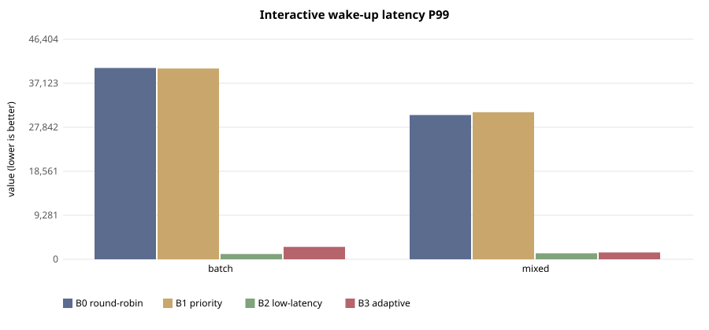
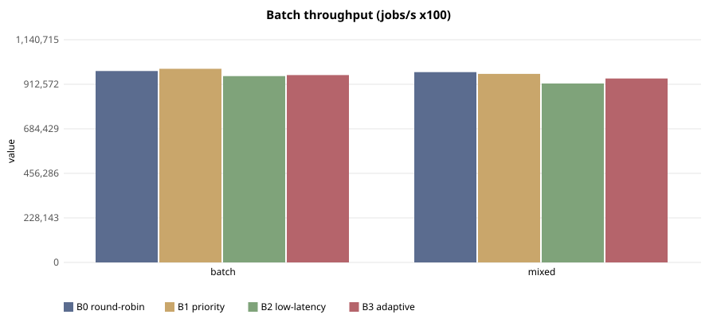

# E-109 — suite `sched`

- Date 2026-09-26T15:38:00Z, commit `5e3f4cf-dirty`, kernel FuhrerOS 0.1.0 (own kernel)
- Host Linux 6.6.87.2-microsoft-standard-WSL2 x86_64 / AMD Ryzen 5 7520U with Radeon Graphics (Windows 11 -> WSL2 -> QEMU; KVM nested inside WSL2 when accel=kvm)
- QEMU emulator version 10.2.1 (Debian 1:10.2.1+ds-1ubuntu3.1), accel **kvm**, 4 vCPU offered (FuhrerOS uses 1), 4096 MB
- virtio-blk, FFS0 raw image, host cache=writeback; virtio-net, QEMU user-mode (slirp)

## Scheduler — scenario `batch` (median of 5 runs; CV%)

| metric | B0 round-robin | B1 priority | B2 low-latency | B3 adaptive |
|---|---|---|---|---|
| dispatch p50 (us) | 39,080 (0%) | 39,080 (0%) | 7 (44%) | 7 (40%) |
| dispatch p99 (us) | 39,375 (1%) | 39,263 (3%) | 75 (55%) | 134 (108%) |
| wake p50 (us) | 40,054 (0%) | 40,054 (0%) | 978 (0%) | 979 (0%) |
| wake p99 (us) | 40,351 (1%) | 40,237 (2%) | 1,115 (89%) | 2,626 (86%) |
| response p99 (us) | 50,390 (1%) | 50,277 (2%) | 11,184 (21%) | 12,924 (25%) |
| batch jobs/s (x100) | 980,673 (6%) | 991,926 (5%) | 954,722 (10%) | 959,917 (15%) |
| I/O ops/s | 0 (0%) | 0 (0%) | 0 (0%) | 0 (0%) |
| fairness (Jain x1000) | 999 (0%) | 999 (0%) | 999 (0%) | 999 (0%) |
| ctx switches/s | 144 (0%) | 144 (0%) | 784 (2%) | 315 (3%) |
| sched overhead ns/s | 24,783 (59%) | 18,942 (53%) | 118,986 (31%) | 54,696 (95%) |
| system class (mid-run) | CPU_BOUND | CPU_BOUND | CPU_BOUND | CPU_BOUND |

Per-worker classes assigned by the kernel at mid-run:

- B0 round-robin: `cpu:CPU_BOUND,cpu:CPU_BOUND,cpu:CPU_BOUND,cpu:CPU_BOUND,probe:INTERACTIVE`
- B1 priority: `cpu:CPU_BOUND,cpu:CPU_BOUND,cpu:CPU_BOUND,cpu:CPU_BOUND,probe:INTERACTIVE`
- B2 low-latency: `cpu:CPU_BOUND,cpu:CPU_BOUND,cpu:CPU_BOUND,cpu:CPU_BOUND,probe:INTERACTIVE`
- B3 adaptive: `cpu:CPU_BOUND,cpu:CPU_BOUND,cpu:CPU_BOUND,cpu:CPU_BOUND,probe:INTERACTIVE`

## Scheduler — scenario `mixed` (median of 5 runs; CV%)

| metric | B0 round-robin | B1 priority | B2 low-latency | B3 adaptive |
|---|---|---|---|---|
| dispatch p50 (us) | 29,062 (0%) | 29,062 (0%) | 7 (21%) | 6 (9%) |
| dispatch p99 (us) | 29,370 (3%) | 30,062 (3%) | 125 (29%) | 154 (61%) |
| wake p50 (us) | 30,035 (0%) | 30,034 (0%) | 978 (0%) | 979 (0%) |
| wake p99 (us) | 30,435 (2%) | 31,030 (5%) | 1,254 (94%) | 1,442 (54%) |
| response p99 (us) | 40,493 (2%) | 41,069 (4%) | 11,323 (17%) | 11,689 (8%) |
| batch jobs/s (x100) | 975,026 (1%) | 966,004 (4%) | 916,757 (5%) | 942,326 (4%) |
| I/O ops/s | 21 (3%) | 22 (3%) | 506 (1%) | 498 (1%) |
| fairness (Jain x1000) | 999 (0%) | 999 (0%) | 999 (0%) | 999 (0%) |
| ctx switches/s | 188 (0%) | 188 (0%) | 1,946 (1%) | 1,758 (1%) |
| sched overhead ns/s | 24,928 (31%) | 36,054 (34%) | 160,431 (40%) | 131,734 (82%) |
| system class (mid-run) | CPU_BOUND | CPU_BOUND | IO_BOUND | IO_BOUND |

Per-worker classes assigned by the kernel at mid-run:

- B0 round-robin: `cpu:CPU_BOUND,cpu:CPU_BOUND,cpu:CPU_BOUND,io:INTERACTIVE,probe:INTERACTIVE`
- B1 priority: `cpu:CPU_BOUND,cpu:CPU_BOUND,cpu:CPU_BOUND,io:INTERACTIVE,probe:INTERACTIVE`
- B2 low-latency: `cpu:CPU_BOUND,cpu:CPU_BOUND,cpu:CPU_BOUND,io:IO_BOUND,probe:INTERACTIVE`
- B3 adaptive: `cpu:CPU_BOUND,cpu:CPU_BOUND,cpu:CPU_BOUND,io:IO_BOUND,probe:INTERACTIVE`

## Threats to validity

- Nested virtualisation (Windows → WSL2 → KVM): absolute times are not bare-metal times; comparisons are between policies within one boot.
- FuhrerOS schedules on one CPU (the BSP); extra vCPUs offered by QEMU are idle.
- Sleepers are woken by the 1000 Hz tick, so *wake* latency includes up to 1 ms of timer granularity whose phase depends on the per-boot LAPIC calibration (F-117): compare wake latency only within one experiment. *Dispatch* latency (runnable → running) does not have this problem.
- Small repetition counts; see CV%.
