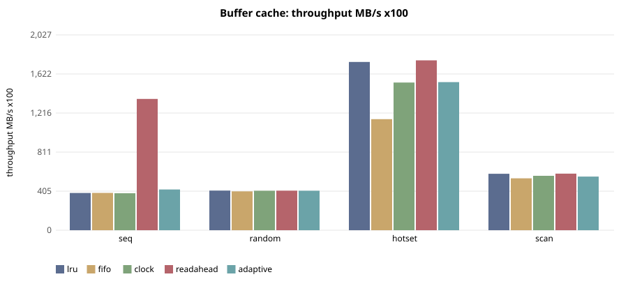
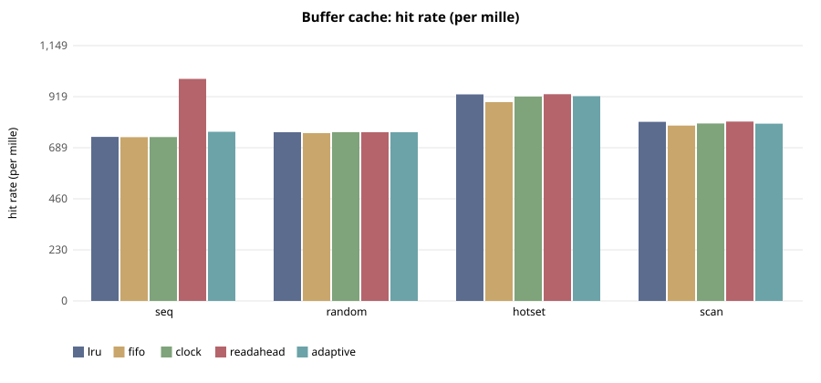

# E-110 — suite `cache`

- Date 2026-09-26T15:45:10Z, commit `5e3f4cf-dirty`, kernel FuhrerOS 0.1.0 (own kernel)
- Host Linux 6.6.87.2-microsoft-standard-WSL2 x86_64 / AMD Ryzen 5 7520U with Radeon Graphics (Windows 11 -> WSL2 -> QEMU; KVM nested inside WSL2 when accel=kvm)
- QEMU emulator version 10.2.1 (Debian 1:10.2.1+ds-1ubuntu3.1), accel **kvm**, 4 vCPU offered (FuhrerOS uses 1), 4096 MB
- virtio-blk, FFS0 raw image, host cache=writeback; virtio-net, QEMU user-mode (slirp)

## Buffer cache — throughput MB/s x100 (median)

| workload | lru | fifo | clock | readahead | adaptive |
|---|---|---|---|---|---|
| seq | 387 | 388 | 384 | 1,362 | 423 |
| random | 411 | 403 | 410 | 410 | 410 |
| hotset | 1,746 | 1,153 | 1,533 | 1,763 | 1,538 |
| scan | 586 | 539 | 564 | 587 | 557 |

## Buffer cache — hit rate (per mille) (median)

| workload | lru | fifo | clock | readahead | adaptive |
|---|---|---|---|---|---|
| seq | 738 | 737 | 738 | 999 | 761 |
| random | 759 | 755 | 760 | 759 | 759 |
| hotset | 930 | 894 | 920 | 930 | 921 |
| scan | 806 | 789 | 798 | 807 | 798 |

## Buffer cache — read latency p99 (us) (median)

| workload | lru | fifo | clock | readahead | adaptive |
|---|---|---|---|---|---|
| seq | 1,300 | 1,188 | 1,574 | 78 | 2,122 |
| random | 1,184 | 2,001 | 1,252 | 1,209 | 1,299 |
| hotset | 1,084 | 1,328 | 1,072 | 1,070 | 1,084 |
| scan | 1,110 | 1,208 | 1,136 | 1,132 | 1,224 |

## Buffer cache — cache CPU (us) (median)

| workload | lru | fifo | clock | readahead | adaptive |
|---|---|---|---|---|---|
| seq | 10,352 | 7,656 | 12,123 | 3,652,773 | 198,806 |
| random | 10,904 | 11,078 | 9,470 | 11,488 | 12,460 |
| hotset | 26,058 | 18,022 | 14,754 | 19,740 | 22,079 |
| scan | 10,429 | 11,168 | 10,674 | 11,992 | 13,198 |

## Threats to validity

- Nested virtualisation (Windows → WSL2 → KVM): absolute times are not bare-metal times; comparisons are between policies within one boot.
- FuhrerOS schedules on one CPU (the BSP); extra vCPUs offered by QEMU are idle.
- Sleepers are woken by the 1000 Hz tick, so *wake* latency includes up to 1 ms of timer granularity whose phase depends on the per-boot LAPIC calibration (F-117): compare wake latency only within one experiment. *Dispatch* latency (runnable → running) does not have this problem.
- Small repetition counts; see CV%.
