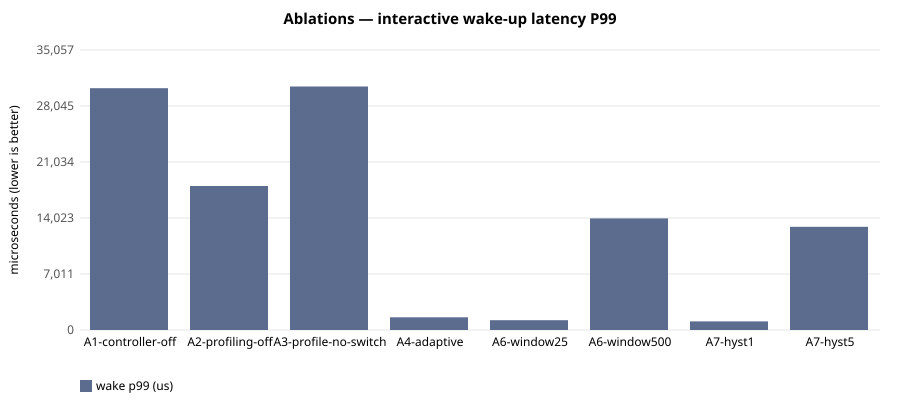

# E-112 — suite `ablation`

- Date 2026-09-26T15:52:16Z, commit `5e3f4cf-dirty`, kernel FuhrerOS 0.1.0 (own kernel)
- Host Linux 6.6.87.2-microsoft-standard-WSL2 x86_64 / AMD Ryzen 5 7520U with Radeon Graphics (Windows 11 -> WSL2 -> QEMU; KVM nested inside WSL2 when accel=kvm)
- QEMU emulator version 10.2.1 (Debian 1:10.2.1+ds-1ubuntu3.1), accel **kvm**, 4 vCPU offered (FuhrerOS uses 1), 4096 MB
- virtio-blk, FFS0 raw image, host cache=writeback; virtio-net, QEMU user-mode (slirp)

## Scheduler — scenario `A1-controller-off` (median of 3 runs; CV%)

| metric | B1 priority |
|---|---|
| dispatch p50 (us) | 29,063 (0%) |
| dispatch p99 (us) | 29,292 (2%) |
| wake p50 (us) | 30,038 (0%) |
| wake p99 (us) | 30,269 (2%) |
| response p99 (us) | 40,657 (1%) |
| batch jobs/s (x100) | 980,543 (1%) |
| I/O ops/s | 21 (3%) |
| fairness (Jain x1000) | 999 (0%) |
| ctx switches/s | 188 (0%) |
| sched overhead ns/s | 22,262 (27%) |
| system class (mid-run) | CPU_BOUND |

Per-worker classes assigned by the kernel at mid-run:

- B1 priority: `cpu:CPU_BOUND,cpu:CPU_BOUND,cpu:CPU_BOUND,io:INTERACTIVE,probe:INTERACTIVE`

## Scheduler — scenario `A2-profiling-off` (median of 3 runs; CV%)

| metric | B3 adaptive |
|---|---|
| dispatch p50 (us) | 11,036 (5%) |
| dispatch p99 (us) | 17,046 (0%) |
| wake p50 (us) | 12,005 (4%) |
| wake p99 (us) | 18,025 (0%) |
| response p99 (us) | 28,067 (0%) |
| batch jobs/s (x100) | 975,158 (4%) |
| I/O ops/s | 44 (0%) |
| fairness (Jain x1000) | 999 (0%) |
| ctx switches/s | 423 (1%) |
| sched overhead ns/s | 63,171 (26%) |
| system class (mid-run) | IDLE |

Per-worker classes assigned by the kernel at mid-run:

- B3 adaptive: `cpu:UNKNOWN,cpu:UNKNOWN,cpu:UNKNOWN,io:UNKNOWN,probe:UNKNOWN`

## Scheduler — scenario `A3-profile-no-switch` (median of 3 runs; CV%)

| metric | B0 round-robin |
|---|---|
| dispatch p50 (us) | 29,065 (0%) |
| dispatch p99 (us) | 29,931 (1%) |
| wake p50 (us) | 30,038 (0%) |
| wake p99 (us) | 30,484 (1%) |
| response p99 (us) | 40,925 (1%) |
| batch jobs/s (x100) | 967,164 (3%) |
| I/O ops/s | 21 (5%) |
| fairness (Jain x1000) | 999 (0%) |
| ctx switches/s | 188 (0%) |
| sched overhead ns/s | 33,349 (78%) |
| system class (mid-run) | CPU_BOUND |

Per-worker classes assigned by the kernel at mid-run:

- B0 round-robin: `cpu:CPU_BOUND,cpu:CPU_BOUND,cpu:CPU_BOUND,io:INTERACTIVE,probe:INTERACTIVE`

## Scheduler — scenario `A4-adaptive` (median of 3 runs; CV%)

| metric | B3 adaptive |
|---|---|
| dispatch p50 (us) | 6 (9%) |
| dispatch p99 (us) | 152 (32%) |
| wake p50 (us) | 980 (0%) |
| wake p99 (us) | 1,591 (39%) |
| response p99 (us) | 11,630 (6%) |
| batch jobs/s (x100) | 964,980 (4%) |
| I/O ops/s | 499 (1%) |
| fairness (Jain x1000) | 999 (0%) |
| ctx switches/s | 1,766 (1%) |
| sched overhead ns/s | 196,545 (43%) |
| system class (mid-run) | IO_BOUND |

Per-worker classes assigned by the kernel at mid-run:

- B3 adaptive: `cpu:CPU_BOUND,cpu:CPU_BOUND,cpu:CPU_BOUND,io:IO_BOUND,probe:INTERACTIVE`

## Scheduler — scenario `A6-window25` (median of 3 runs; CV%)

| metric | B3 adaptive |
|---|---|
| dispatch p50 (us) | 6 (0%) |
| dispatch p99 (us) | 49 (82%) |
| wake p50 (us) | 980 (0%) |
| wake p99 (us) | 1,230 (17%) |
| response p99 (us) | 11,270 (3%) |
| batch jobs/s (x100) | 953,931 (1%) |
| I/O ops/s | 507 (0%) |
| fairness (Jain x1000) | 999 (0%) |
| ctx switches/s | 1,772 (0%) |
| sched overhead ns/s | 194,948 (18%) |
| system class (mid-run) | IO_BOUND |

Per-worker classes assigned by the kernel at mid-run:

- B3 adaptive: `cpu:CPU_BOUND,cpu:CPU_BOUND,cpu:CPU_BOUND,io:IO_BOUND,probe:INTERACTIVE` | `cpu:CPU_BOUND,cpu:IDLE,cpu:CPU_BOUND,io:IO_BOUND,probe:INTERACTIVE` | `cpu:IDLE,cpu:IDLE,cpu:CPU_BOUND,io:IO_BOUND,probe:INTERACTIVE`

## Scheduler — scenario `A6-window500` (median of 3 runs; CV%)

| metric | B3 adaptive |
|---|---|
| dispatch p50 (us) | 6 (9%) |
| dispatch p99 (us) | 13,025 (5%) |
| wake p50 (us) | 981 (0%) |
| wake p99 (us) | 13,974 (4%) |
| response p99 (us) | 24,013 (2%) |
| batch jobs/s (x100) | 963,912 (2%) |
| I/O ops/s | 477 (2%) |
| fairness (Jain x1000) | 999 (0%) |
| ctx switches/s | 1,692 (2%) |
| sched overhead ns/s | 132,147 (47%) |
| system class (mid-run) | IO_BOUND |

Per-worker classes assigned by the kernel at mid-run:

- B3 adaptive: `cpu:CPU_BOUND,cpu:CPU_BOUND,cpu:CPU_BOUND,io:IO_BOUND,probe:INTERACTIVE`

## Scheduler — scenario `A7-hyst1` (median of 3 runs; CV%)

| metric | B3 adaptive |
|---|---|
| dispatch p50 (us) | 6 (9%) |
| dispatch p99 (us) | 52 (24%) |
| wake p50 (us) | 980 (0%) |
| wake p99 (us) | 1,075 (6%) |
| response p99 (us) | 11,137 (1%) |
| batch jobs/s (x100) | 952,685 (1%) |
| I/O ops/s | 507 (0%) |
| fairness (Jain x1000) | 999 (0%) |
| ctx switches/s | 1,775 (1%) |
| sched overhead ns/s | 144,811 (20%) |
| system class (mid-run) | IO_BOUND |

Per-worker classes assigned by the kernel at mid-run:

- B3 adaptive: `cpu:CPU_BOUND,cpu:CPU_BOUND,cpu:CPU_BOUND,io:IO_BOUND,probe:INTERACTIVE`

## Scheduler — scenario `A7-hyst5` (median of 3 runs; CV%)

| metric | B3 adaptive |
|---|---|
| dispatch p50 (us) | 6 (9%) |
| dispatch p99 (us) | 12,030 (8%) |
| wake p50 (us) | 980 (0%) |
| wake p99 (us) | 12,924 (8%) |
| response p99 (us) | 22,962 (4%) |
| batch jobs/s (x100) | 943,310 (2%) |
| I/O ops/s | 487 (1%) |
| fairness (Jain x1000) | 999 (0%) |
| ctx switches/s | 1,717 (0%) |
| sched overhead ns/s | 158,161 (41%) |
| system class (mid-run) | IO_BOUND |

Per-worker classes assigned by the kernel at mid-run:

- B3 adaptive: `cpu:CPU_BOUND,cpu:CPU_BOUND,cpu:CPU_BOUND,io:IO_BOUND,probe:INTERACTIVE`

## Threats to validity

- Nested virtualisation (Windows → WSL2 → KVM): absolute times are not bare-metal times; comparisons are between policies within one boot.
- FuhrerOS schedules on one CPU (the BSP); extra vCPUs offered by QEMU are idle.
- Sleepers are woken by the 1000 Hz tick, so *wake* latency includes up to 1 ms of timer granularity whose phase depends on the per-boot LAPIC calibration (F-117): compare wake latency only within one experiment. *Dispatch* latency (runnable → running) does not have this problem.
- Small repetition counts; see CV%.
