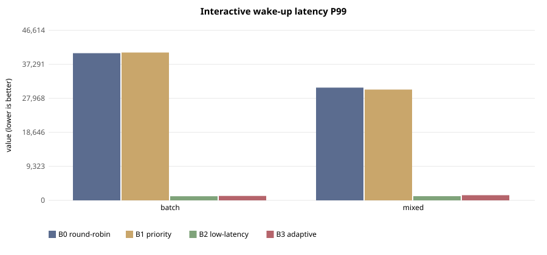
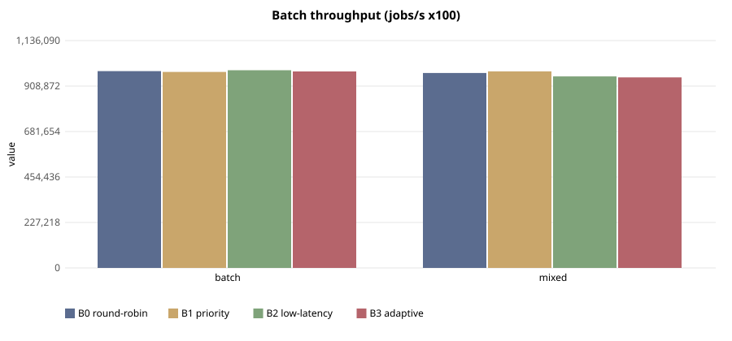

# E-113 — suite `sched`

- Date 2026-09-26T15:59:27Z, commit `689bf6c`, kernel FuhrerOS 0.1.0 (own kernel)
- Host Linux 6.6.87.2-microsoft-standard-WSL2 x86_64 / AMD Ryzen 5 7520U with Radeon Graphics (Windows 11 -> WSL2 -> QEMU; KVM nested inside WSL2 when accel=kvm)
- QEMU emulator version 10.2.1 (Debian 1:10.2.1+ds-1ubuntu3.1), accel **kvm**, 4 vCPU offered (FuhrerOS uses 1), 4096 MB
- virtio-blk, FFS0 raw image, host cache=writeback; virtio-net, QEMU user-mode (slirp)

## Scheduler — scenario `batch` (median of 5 runs; CV%)

| metric | B0 round-robin | B1 priority | B2 low-latency | B3 adaptive |
|---|---|---|---|---|
| dispatch p50 (us) | 39,099 (0%) | 39,099 (0%) | 6 (50%) | 7 (0%) |
| dispatch p99 (us) | 39,382 (1%) | 39,551 (5%) | 68 (58%) | 78 (43%) |
| wake p50 (us) | 40,079 (0%) | 40,079 (0%) | 984 (0%) | 984 (0%) |
| wake p99 (us) | 40,360 (1%) | 40,534 (7%) | 1,137 (62%) | 1,211 (6%) |
| response p99 (us) | 50,399 (1%) | 50,759 (6%) | 11,214 (10%) | 11,256 (1%) |
| batch jobs/s (x100) | 983,373 (3%) | 979,438 (4%) | 987,904 (10%) | 981,954 (1%) |
| I/O ops/s | 0 (0%) | 0 (0%) | 0 (0%) | 0 (0%) |
| fairness (Jain x1000) | 999 (0%) | 999 (0%) | 999 (0%) | 999 (0%) |
| ctx switches/s | 144 (0%) | 145 (0%) | 787 (1%) | 314 (0%) |
| sched overhead ns/s | 24,421 (13%) | 48,276 (101%) | 103,090 (156%) | 39,672 (17%) |
| system class (mid-run) | CPU_BOUND | CPU_BOUND | CPU_BOUND | CPU_BOUND |

Per-worker classes assigned by the kernel at mid-run:

- B0 round-robin: `cpu:CPU_BOUND,cpu:CPU_BOUND,cpu:CPU_BOUND,cpu:CPU_BOUND,probe:INTERACTIVE`
- B1 priority: `cpu:CPU_BOUND,cpu:CPU_BOUND,cpu:CPU_BOUND,cpu:CPU_BOUND,probe:INTERACTIVE`
- B2 low-latency: `cpu:CPU_BOUND,cpu:CPU_BOUND,cpu:CPU_BOUND,cpu:CPU_BOUND,probe:INTERACTIVE`
- B3 adaptive: `cpu:CPU_BOUND,cpu:CPU_BOUND,cpu:CPU_BOUND,cpu:CPU_BOUND,probe:INTERACTIVE`

## Scheduler — scenario `mixed` (median of 5 runs; CV%)

| metric | B0 round-robin | B1 priority | B2 low-latency | B3 adaptive |
|---|---|---|---|---|
| dispatch p50 (us) | 29,077 (0%) | 29,076 (0%) | 7 (6%) | 7 (8%) |
| dispatch p99 (us) | 29,713 (3%) | 29,336 (13%) | 109 (15%) | 135 (48%) |
| wake p50 (us) | 30,055 (0%) | 30,055 (0%) | 983 (0%) | 984 (0%) |
| wake p99 (us) | 30,922 (3%) | 30,381 (12%) | 1,157 (37%) | 1,414 (12%) |
| response p99 (us) | 40,960 (2%) | 40,421 (9%) | 11,196 (5%) | 11,453 (2%) |
| batch jobs/s (x100) | 974,371 (6%) | 982,502 (3%) | 957,295 (2%) | 952,167 (2%) |
| I/O ops/s | 21 (4%) | 21 (4%) | 510 (0%) | 501 (0%) |
| fairness (Jain x1000) | 999 (0%) | 999 (0%) | 999 (0%) | 999 (0%) |
| ctx switches/s | 188 (0%) | 188 (0%) | 1,958 (1%) | 1,760 (0%) |
| sched overhead ns/s | 29,250 (54%) | 22,606 (39%) | 115,654 (42%) | 164,812 (38%) |
| system class (mid-run) | CPU_BOUND | CPU_BOUND | IO_BOUND | IO_BOUND |

Per-worker classes assigned by the kernel at mid-run:

- B0 round-robin: `cpu:CPU_BOUND,cpu:CPU_BOUND,cpu:CPU_BOUND,io:INTERACTIVE,probe:INTERACTIVE`
- B1 priority: `cpu:CPU_BOUND,cpu:CPU_BOUND,cpu:CPU_BOUND,io:INTERACTIVE,probe:INTERACTIVE`
- B2 low-latency: `cpu:CPU_BOUND,cpu:CPU_BOUND,cpu:CPU_BOUND,io:IO_BOUND,probe:INTERACTIVE`
- B3 adaptive: `cpu:CPU_BOUND,cpu:CPU_BOUND,cpu:CPU_BOUND,io:IO_BOUND,probe:INTERACTIVE`

## Threats to validity

- Nested virtualisation (Windows → WSL2 → KVM): absolute times are not bare-metal times; comparisons are between policies within one boot.
- FuhrerOS schedules on one CPU (the BSP); extra vCPUs offered by QEMU are idle.
- Sleepers are woken by the 1000 Hz tick, so *wake* latency includes up to 1 ms of timer granularity whose phase depends on the per-boot LAPIC calibration (F-117): compare wake latency only within one experiment. *Dispatch* latency (runnable → running) does not have this problem.
- Small repetition counts; see CV%.
