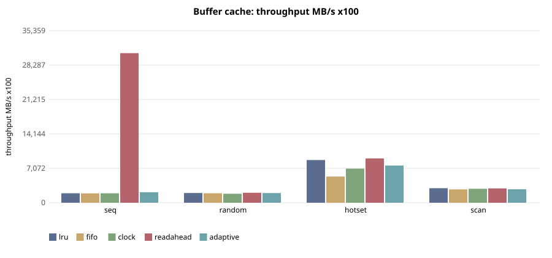
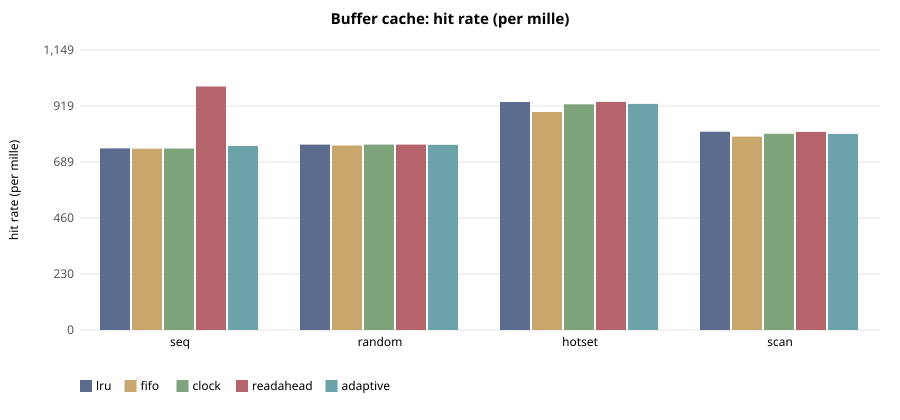

# E-114 — suite `cache`

- Date 2026-09-26T16:06:37Z, commit `689bf6c-dirty`, kernel FuhrerOS 0.1.0 (own kernel)
- Host Linux 6.6.87.2-microsoft-standard-WSL2 x86_64 / AMD Ryzen 5 7520U with Radeon Graphics (Windows 11 -> WSL2 -> QEMU; KVM nested inside WSL2 when accel=kvm)
- QEMU emulator version 10.2.1 (Debian 1:10.2.1+ds-1ubuntu3.1), accel **kvm**, 4 vCPU offered (FuhrerOS uses 1), 4096 MB
- virtio-blk, FFS0 raw image, host cache=writeback; virtio-net, QEMU user-mode (slirp)

## Buffer cache — throughput MB/s x100 (median)

| workload | lru | fifo | clock | readahead | adaptive |
|---|---|---|---|---|---|
| seq | 1,947 | 1,918 | 1,928 | 30,747 | 2,162 |
| random | 1,992 | 1,943 | 1,838 | 2,042 | 1,981 |
| hotset | 8,782 | 5,380 | 7,010 | 9,100 | 7,637 |
| scan | 2,976 | 2,744 | 2,862 | 2,938 | 2,760 |

## Buffer cache — hit rate (per mille) (median)

| workload | lru | fifo | clock | readahead | adaptive |
|---|---|---|---|---|---|
| seq | 745 | 744 | 744 | 999 | 755 |
| random | 760 | 757 | 760 | 760 | 760 |
| hotset | 936 | 894 | 926 | 936 | 928 |
| scan | 814 | 794 | 805 | 813 | 804 |

## Buffer cache — read latency p99 (us) (median)

| workload | lru | fifo | clock | readahead | adaptive |
|---|---|---|---|---|---|
| seq | 549 | 572 | 529 | 66 | 778 |
| random | 504 | 552 | 614 | 474 | 569 |
| hotset | 358 | 425 | 414 | 328 | 400 |
| scan | 454 | 448 | 444 | 472 | 479 |

## Buffer cache — cache CPU per read (ns) (median)

| workload | lru | fifo | clock | readahead | adaptive |
|---|---|---|---|---|---|
| seq | 632 | 768 | 675 | 8,111 | 23,047 |
| random | 1,102 | 1,094 | 1,102 | 1,070 | 1,060 |
| hotset | 428 | 506 | 504 | 422 | 424 |
| scan | 728 | 643 | 670 | 696 | 746 |

## Threats to validity

- Nested virtualisation (Windows → WSL2 → KVM): absolute times are not bare-metal times; comparisons are between policies within one boot.
- FuhrerOS schedules on one CPU (the BSP); extra vCPUs offered by QEMU are idle.
- Sleepers are woken by the 1000 Hz tick, so *wake* latency includes up to 1 ms of timer granularity whose phase depends on the per-boot LAPIC calibration (F-117): compare wake latency only within one experiment. *Dispatch* latency (runnable → running) does not have this problem.
- Small repetition counts; see CV%.
