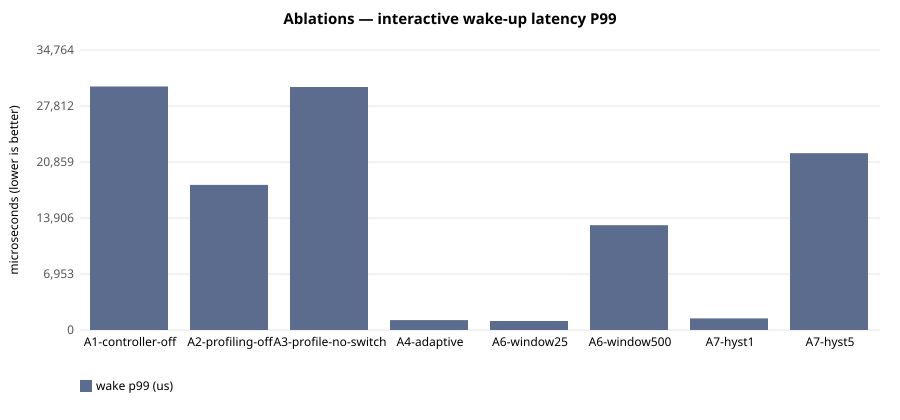

# E-116 — suite `ablation`

- Date 2026-09-26T16:13:33Z, commit `689bf6c-dirty`, kernel FuhrerOS 0.1.0 (own kernel)
- Host Linux 6.6.87.2-microsoft-standard-WSL2 x86_64 / AMD Ryzen 5 7520U with Radeon Graphics (Windows 11 -> WSL2 -> QEMU; KVM nested inside WSL2 when accel=kvm)
- QEMU emulator version 10.2.1 (Debian 1:10.2.1+ds-1ubuntu3.1), accel **kvm**, 4 vCPU offered (FuhrerOS uses 1), 4096 MB
- virtio-blk, FFS0 raw image, host cache=writeback; virtio-net, QEMU user-mode (slirp)

## Scheduler — scenario `A1-controller-off` (median of 3 runs; CV%)

| metric | B1 priority |
|---|---|
| dispatch p50 (us) | 29,047 (0%) |
| dispatch p99 (us) | 29,263 (0%) |
| wake p50 (us) | 30,014 (0%) |
| wake p99 (us) | 30,230 (0%) |
| response p99 (us) | 40,306 (0%) |
| batch jobs/s (x100) | 982,633 (0%) |
| I/O ops/s | 22 (3%) |
| fairness (Jain x1000) | 999 (0%) |
| ctx switches/s | 188 (0%) |
| sched overhead ns/s | 35,034 (6%) |
| system class (mid-run) | CPU_BOUND |

Per-worker classes assigned by the kernel at mid-run:

- B1 priority: `cpu:CPU_BOUND,cpu:CPU_BOUND,cpu:CPU_BOUND,io:INTERACTIVE,probe:INTERACTIVE`

## Scheduler — scenario `A2-profiling-off` (median of 3 runs; CV%)

| metric | B3 adaptive |
|---|---|
| dispatch p50 (us) | 12,005 (5%) |
| dispatch p99 (us) | 17,065 (0%) |
| wake p50 (us) | 12,917 (4%) |
| wake p99 (us) | 18,010 (0%) |
| response p99 (us) | 28,049 (0%) |
| batch jobs/s (x100) | 987,963 (0%) |
| I/O ops/s | 44 (1%) |
| fairness (Jain x1000) | 999 (0%) |
| ctx switches/s | 423 (0%) |
| sched overhead ns/s | 52,755 (20%) |
| system class (mid-run) | IDLE |

Per-worker classes assigned by the kernel at mid-run:

- B3 adaptive: `cpu:UNKNOWN,cpu:UNKNOWN,cpu:UNKNOWN,io:UNKNOWN,probe:UNKNOWN`

## Scheduler — scenario `A3-profile-no-switch` (median of 3 runs; CV%)

| metric | B0 round-robin |
|---|---|
| dispatch p50 (us) | 29,046 (0%) |
| dispatch p99 (us) | 29,184 (0%) |
| wake p50 (us) | 30,015 (0%) |
| wake p99 (us) | 30,176 (0%) |
| response p99 (us) | 40,216 (0%) |
| batch jobs/s (x100) | 988,688 (1%) |
| I/O ops/s | 22 (3%) |
| fairness (Jain x1000) | 999 (0%) |
| ctx switches/s | 188 (0%) |
| sched overhead ns/s | 39,418 (16%) |
| system class (mid-run) | CPU_BOUND |

Per-worker classes assigned by the kernel at mid-run:

- B0 round-robin: `cpu:CPU_BOUND,cpu:CPU_BOUND,cpu:CPU_BOUND,io:INTERACTIVE,probe:INTERACTIVE`

## Scheduler — scenario `A4-adaptive` (median of 3 runs; CV%)

| metric | B3 adaptive |
|---|---|
| dispatch p50 (us) | 6 (0%) |
| dispatch p99 (us) | 89 (43%) |
| wake p50 (us) | 975 (0%) |
| wake p99 (us) | 1,234 (15%) |
| response p99 (us) | 11,383 (2%) |
| batch jobs/s (x100) | 973,205 (1%) |
| I/O ops/s | 499 (0%) |
| fairness (Jain x1000) | 999 (0%) |
| ctx switches/s | 1,763 (0%) |
| sched overhead ns/s | 122,950 (14%) |
| system class (mid-run) | IO_BOUND |

Per-worker classes assigned by the kernel at mid-run:

- B3 adaptive: `cpu:CPU_BOUND,cpu:CPU_BOUND,cpu:CPU_BOUND,io:IO_BOUND,probe:INTERACTIVE`

## Scheduler — scenario `A6-window25` (median of 3 runs; CV%)

| metric | B3 adaptive |
|---|---|
| dispatch p50 (us) | 7 (21%) |
| dispatch p99 (us) | 43 (89%) |
| wake p50 (us) | 973 (0%) |
| wake p99 (us) | 1,113 (76%) |
| response p99 (us) | 11,152 (13%) |
| batch jobs/s (x100) | 961,831 (7%) |
| I/O ops/s | 505 (1%) |
| fairness (Jain x1000) | 999 (0%) |
| ctx switches/s | 1,776 (1%) |
| sched overhead ns/s | 141,342 (100%) |
| system class (mid-run) | IO_BOUND |

Per-worker classes assigned by the kernel at mid-run:

- B3 adaptive: `cpu:CPU_BOUND,cpu:CPU_BOUND,cpu:CPU_BOUND,io:IO_BOUND,probe:INTERACTIVE`

## Scheduler — scenario `A6-window500` (median of 3 runs; CV%)

| metric | B3 adaptive |
|---|---|
| dispatch p50 (us) | 6 (9%) |
| dispatch p99 (us) | 12,028 (5%) |
| wake p50 (us) | 974 (0%) |
| wake p99 (us) | 13,016 (4%) |
| response p99 (us) | 23,055 (2%) |
| batch jobs/s (x100) | 968,956 (1%) |
| I/O ops/s | 479 (0%) |
| fairness (Jain x1000) | 999 (0%) |
| ctx switches/s | 1,698 (0%) |
| sched overhead ns/s | 119,947 (55%) |
| system class (mid-run) | IO_BOUND |

Per-worker classes assigned by the kernel at mid-run:

- B3 adaptive: `cpu:CPU_BOUND,cpu:CPU_BOUND,cpu:CPU_BOUND,io:IO_BOUND,probe:INTERACTIVE`

## Scheduler — scenario `A7-hyst1` (median of 3 runs; CV%)

| metric | B3 adaptive |
|---|---|
| dispatch p50 (us) | 6 (0%) |
| dispatch p99 (us) | 44 (27%) |
| wake p50 (us) | 975 (0%) |
| wake p99 (us) | 1,436 (16%) |
| response p99 (us) | 11,514 (2%) |
| batch jobs/s (x100) | 956,928 (1%) |
| I/O ops/s | 505 (0%) |
| fairness (Jain x1000) | 999 (0%) |
| ctx switches/s | 1,768 (0%) |
| sched overhead ns/s | 148,094 (10%) |
| system class (mid-run) | IO_BOUND |

Per-worker classes assigned by the kernel at mid-run:

- B3 adaptive: `cpu:CPU_BOUND,cpu:CPU_BOUND,cpu:CPU_BOUND,io:IO_BOUND,probe:INTERACTIVE`

## Scheduler — scenario `A7-hyst5` (median of 3 runs; CV%)

| metric | B3 adaptive |
|---|---|
| dispatch p50 (us) | 6 (0%) |
| dispatch p99 (us) | 21,027 (25%) |
| wake p50 (us) | 975 (0%) |
| wake p99 (us) | 21,950 (24%) |
| response p99 (us) | 31,989 (16%) |
| batch jobs/s (x100) | 971,066 (1%) |
| I/O ops/s | 487 (1%) |
| fairness (Jain x1000) | 999 (0%) |
| ctx switches/s | 1,722 (1%) |
| sched overhead ns/s | 137,018 (11%) |
| system class (mid-run) | IO_BOUND |

Per-worker classes assigned by the kernel at mid-run:

- B3 adaptive: `cpu:CPU_BOUND,cpu:CPU_BOUND,cpu:CPU_BOUND,io:IO_BOUND,probe:INTERACTIVE`

## Threats to validity

- Nested virtualisation (Windows → WSL2 → KVM): absolute times are not bare-metal times; comparisons are between policies within one boot.
- FuhrerOS schedules on one CPU (the BSP); extra vCPUs offered by QEMU are idle.
- Sleepers are woken by the 1000 Hz tick, so *wake* latency includes up to 1 ms of timer granularity whose phase depends on the per-boot LAPIC calibration (F-117): compare wake latency only within one experiment. *Dispatch* latency (runnable → running) does not have this problem.
- Small repetition counts; see CV%.
