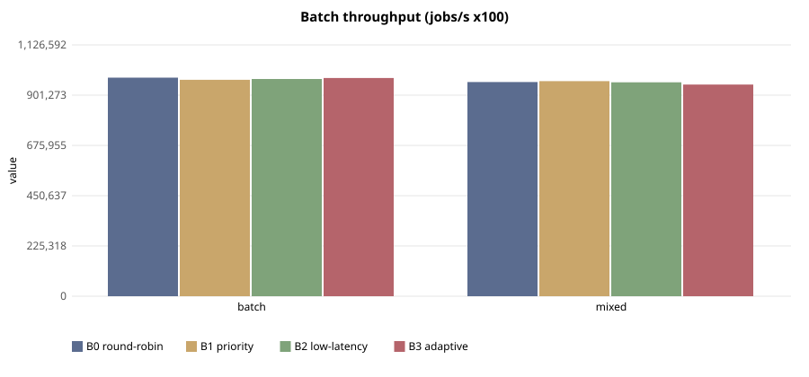

# E-117 — suite `sched`

- Date 2026-09-26T16:20:21Z, commit `e942a12-dirty`, kernel FuhrerOS 0.1.0 (own kernel)
- Host Linux 6.6.87.2-microsoft-standard-WSL2 x86_64 / AMD Ryzen 5 7520U with Radeon Graphics (Windows 11 -> WSL2 -> QEMU; KVM nested inside WSL2 when accel=kvm)
- QEMU emulator version 10.2.1 (Debian 1:10.2.1+ds-1ubuntu3.1), accel **kvm**, 4 vCPU offered (FuhrerOS uses 1), 4096 MB
- virtio-blk, FFS0 raw image, host cache=writeback; virtio-net, QEMU user-mode (slirp)

## Scheduler — scenario `batch` (median of 5 runs; CV%)

| metric | B0 round-robin | B1 priority | B2 low-latency | B3 adaptive |
|---|---|---|---|---|
| dispatch p50 (us) | 39,082 (0%) | 39,081 (0%) | 6 (9%) | 7 (38%) |
| dispatch p99 (us) | 39,219 (1%) | 39,360 (4%) | 52 (38%) | 142 (62%) |
| wake p50 (us) | 40,055 (0%) | 40,055 (0%) | 979 (0%) | 979 (0%) |
| wake p99 (us) | 40,201 (1%) | 40,331 (3%) | 1,140 (5%) | 1,660 (34%) |
| response p99 (us) | 50,240 (1%) | 50,370 (3%) | 11,200 (0%) | 11,702 (8%) |
| batch jobs/s (x100) | 979,645 (2%) | 970,108 (2%) | 973,626 (2%) | 978,091 (7%) |
| I/O ops/s | 0 (0%) | 0 (0%) | 0 (0%) | 0 (0%) |
| fairness (Jain x1000) | 999 (0%) | 999 (0%) | 999 (0%) | 999 (0%) |
| ctx switches/s | 144 (0%) | 144 (0%) | 785 (0%) | 314 (0%) |
| sched overhead ns/s | 26,570 (26%) | 21,119 (23%) | 63,776 (23%) | 86,662 (73%) |
| system class (mid-run) | CPU_BOUND | CPU_BOUND | CPU_BOUND | CPU_BOUND |

Per-worker classes assigned by the kernel at mid-run:

- B0 round-robin: `cpu:CPU_BOUND,cpu:CPU_BOUND,cpu:CPU_BOUND,cpu:CPU_BOUND,probe:INTERACTIVE`
- B1 priority: `cpu:CPU_BOUND,cpu:CPU_BOUND,cpu:CPU_BOUND,cpu:CPU_BOUND,probe:INTERACTIVE`
- B2 low-latency: `cpu:CPU_BOUND,cpu:CPU_BOUND,cpu:CPU_BOUND,cpu:CPU_BOUND,probe:INTERACTIVE`
- B3 adaptive: `cpu:CPU_BOUND,cpu:CPU_BOUND,cpu:CPU_BOUND,cpu:CPU_BOUND,probe:INTERACTIVE`

## Scheduler — scenario `mixed` (median of 5 runs; CV%)

| metric | B0 round-robin | B1 priority | B2 low-latency | B3 adaptive |
|---|---|---|---|---|
| dispatch p50 (us) | 29,062 (0%) | 29,062 (0%) | 7 (21%) | 6 (0%) |
| dispatch p99 (us) | 29,820 (1%) | 29,621 (5%) | 104 (11%) | 84 (60%) |
| wake p50 (us) | 30,035 (0%) | 30,035 (0%) | 979 (0%) | 979 (0%) |
| wake p99 (us) | 30,892 (1%) | 30,625 (7%) | 1,108 (5%) | 1,274 (15%) |
| response p99 (us) | 41,002 (1%) | 40,665 (5%) | 11,157 (1%) | 11,339 (3%) |
| batch jobs/s (x100) | 960,004 (1%) | 964,124 (11%) | 958,827 (4%) | 948,594 (1%) |
| I/O ops/s | 21 (2%) | 22 (3%) | 509 (0%) | 501 (0%) |
| fairness (Jain x1000) | 999 (0%) | 999 (0%) | 999 (0%) | 999 (0%) |
| ctx switches/s | 188 (0%) | 188 (0%) | 1,958 (0%) | 1,753 (0%) |
| sched overhead ns/s | 27,646 (65%) | 25,849 (75%) | 132,013 (40%) | 124,805 (41%) |
| system class (mid-run) | CPU_BOUND | CPU_BOUND | IO_BOUND | IO_BOUND |

Per-worker classes assigned by the kernel at mid-run:

- B0 round-robin: `cpu:CPU_BOUND,cpu:CPU_BOUND,cpu:CPU_BOUND,io:INTERACTIVE,probe:INTERACTIVE`
- B1 priority: `cpu:CPU_BOUND,cpu:CPU_BOUND,cpu:CPU_BOUND,io:INTERACTIVE,probe:INTERACTIVE`
- B2 low-latency: `cpu:CPU_BOUND,cpu:CPU_BOUND,cpu:CPU_BOUND,io:IO_BOUND,probe:INTERACTIVE`
- B3 adaptive: `cpu:CPU_BOUND,cpu:CPU_BOUND,cpu:CPU_BOUND,io:IO_BOUND,probe:INTERACTIVE`

## Threats to validity

- Nested virtualisation (Windows → WSL2 → KVM): absolute times are not bare-metal times; comparisons are between policies within one boot.
- FuhrerOS schedules on one CPU (the BSP); extra vCPUs offered by QEMU are idle.
- Sleepers are woken by the 1000 Hz tick, so *wake* latency includes up to 1 ms of timer granularity whose phase depends on the per-boot LAPIC calibration (F-117): compare wake latency only within one experiment. *Dispatch* latency (runnable → running) does not have this problem.
- Small repetition counts; see CV%.
