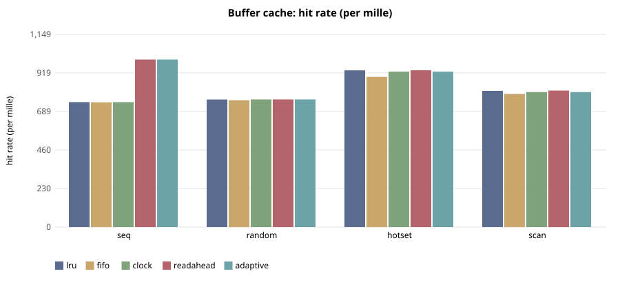

# E-118 — suite `cache`

- Date 2026-09-26T16:27:33Z, commit `e942a12-dirty`, kernel FuhrerOS 0.1.0 (own kernel)
- Host Linux 6.6.87.2-microsoft-standard-WSL2 x86_64 / AMD Ryzen 5 7520U with Radeon Graphics (Windows 11 -> WSL2 -> QEMU; KVM nested inside WSL2 when accel=kvm)
- QEMU emulator version 10.2.1 (Debian 1:10.2.1+ds-1ubuntu3.1), accel **kvm**, 4 vCPU offered (FuhrerOS uses 1), 4096 MB
- virtio-blk, FFS0 raw image, host cache=writeback; virtio-net, QEMU user-mode (slirp)

## Buffer cache — throughput MB/s x100 (median)

| workload | lru | fifo | clock | readahead | adaptive |
|---|---|---|---|---|---|
| seq | 1,967 | 2,028 | 2,025 | 32,113 | 31,158 |
| random | 2,028 | 1,992 | 2,080 | 2,026 | 2,102 |
| hotset | 7,532 | 5,662 | 7,896 | 6,512 | 6,155 |
| scan | 2,722 | 2,590 | 2,802 | 2,918 | 2,687 |

## Buffer cache — hit rate (per mille) (median)

| workload | lru | fifo | clock | readahead | adaptive |
|---|---|---|---|---|---|
| seq | 745 | 744 | 745 | 999 | 999 |
| random | 760 | 756 | 761 | 761 | 761 |
| hotset | 934 | 896 | 927 | 935 | 927 |
| scan | 812 | 794 | 805 | 814 | 805 |

## Buffer cache — read latency p99 (us) (median)

| workload | lru | fifo | clock | readahead | adaptive |
|---|---|---|---|---|---|
| seq | 499 | 468 | 498 | 63 | 74 |
| random | 518 | 552 | 484 | 510 | 460 |
| hotset | 446 | 410 | 356 | 527 | 442 |
| scan | 563 | 494 | 464 | 472 | 488 |

## Buffer cache — cache CPU per read (ns) (median)

| workload | lru | fifo | clock | readahead | adaptive |
|---|---|---|---|---|---|
| seq | 492 | 402 | 460 | 7,814 | 8,060 |
| random | 864 | 897 | 788 | 938 | 826 |
| hotset | 513 | 412 | 338 | 750 | 523 |
| scan | 747 | 746 | 603 | 632 | 756 |

## Threats to validity

- Nested virtualisation (Windows → WSL2 → KVM): absolute times are not bare-metal times; comparisons are between policies within one boot.
- FuhrerOS schedules on one CPU (the BSP); extra vCPUs offered by QEMU are idle.
- Sleepers are woken by the 1000 Hz tick, so *wake* latency includes up to 1 ms of timer granularity whose phase depends on the per-boot LAPIC calibration (F-117): compare wake latency only within one experiment. *Dispatch* latency (runnable → running) does not have this problem.
- Small repetition counts; see CV%.
