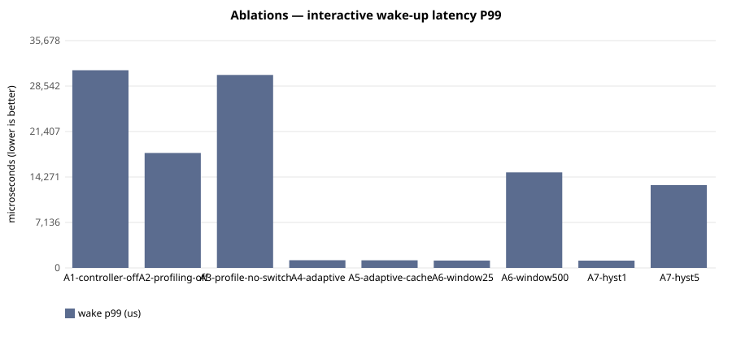

# E-120 — suite `ablation`

- Date 2026-09-26T16:34:28Z, commit `e942a12-dirty`, kernel FuhrerOS 0.1.0 (own kernel)
- Host Linux 6.6.87.2-microsoft-standard-WSL2 x86_64 / AMD Ryzen 5 7520U with Radeon Graphics (Windows 11 -> WSL2 -> QEMU; KVM nested inside WSL2 when accel=kvm)
- QEMU emulator version 10.2.1 (Debian 1:10.2.1+ds-1ubuntu3.1), accel **kvm**, 4 vCPU offered (FuhrerOS uses 1), 4096 MB
- virtio-blk, FFS0 raw image, host cache=writeback; virtio-net, QEMU user-mode (slirp)

## Scheduler — scenario `A1-controller-off` (median of 3 runs; CV%)

| metric | B1 priority |
|---|---|
| dispatch p50 (us) | 29,058 (0%) |
| dispatch p99 (us) | 30,051 (1%) |
| wake p50 (us) | 30,029 (0%) |
| wake p99 (us) | 31,024 (1%) |
| response p99 (us) | 41,064 (1%) |
| batch jobs/s (x100) | 985,723 (1%) |
| I/O ops/s | 20 (6%) |
| fairness (Jain x1000) | 999 (0%) |
| ctx switches/s | 188 (1%) |
| sched overhead ns/s | 24,423 (8%) |
| system class (mid-run) | CPU_BOUND |

Per-worker classes assigned by the kernel at mid-run:

- B1 priority: `cpu:CPU_BOUND,cpu:CPU_BOUND,cpu:CPU_BOUND,io:INTERACTIVE,probe:INTERACTIVE`

## Scheduler — scenario `A2-profiling-off` (median of 3 runs; CV%)

| metric | B3 adaptive |
|---|---|
| dispatch p50 (us) | 11,205 (5%) |
| dispatch p99 (us) | 17,062 (0%) |
| wake p50 (us) | 12,118 (4%) |
| wake p99 (us) | 18,045 (0%) |
| response p99 (us) | 28,083 (0%) |
| batch jobs/s (x100) | 985,365 (1%) |
| I/O ops/s | 44 (2%) |
| fairness (Jain x1000) | 999 (0%) |
| ctx switches/s | 422 (0%) |
| sched overhead ns/s | 48,495 (7%) |
| system class (mid-run) | IDLE |

Per-worker classes assigned by the kernel at mid-run:

- B3 adaptive: `cpu:UNKNOWN,cpu:UNKNOWN,cpu:UNKNOWN,io:UNKNOWN,probe:UNKNOWN`

## Scheduler — scenario `A3-profile-no-switch` (median of 3 runs; CV%)

| metric | B0 round-robin |
|---|---|
| dispatch p50 (us) | 29,057 (0%) |
| dispatch p99 (us) | 29,341 (3%) |
| wake p50 (us) | 30,028 (0%) |
| wake p99 (us) | 30,283 (7%) |
| response p99 (us) | 40,329 (5%) |
| batch jobs/s (x100) | 974,720 (8%) |
| I/O ops/s | 21 (0%) |
| fairness (Jain x1000) | 999 (0%) |
| ctx switches/s | 188 (1%) |
| sched overhead ns/s | 67,255 (67%) |
| system class (mid-run) | CPU_BOUND |

Per-worker classes assigned by the kernel at mid-run:

- B0 round-robin: `cpu:CPU_BOUND,cpu:CPU_BOUND,cpu:CPU_BOUND,io:INTERACTIVE,probe:INTERACTIVE`

## Scheduler — scenario `A4-adaptive` (median of 3 runs; CV%)

| metric | B3 adaptive |
|---|---|
| dispatch p50 (us) | 6 (0%) |
| dispatch p99 (us) | 56 (20%) |
| wake p50 (us) | 978 (0%) |
| wake p99 (us) | 1,207 (7%) |
| response p99 (us) | 11,245 (1%) |
| batch jobs/s (x100) | 957,107 (1%) |
| I/O ops/s | 500 (0%) |
| fairness (Jain x1000) | 999 (0%) |
| ctx switches/s | 1,770 (0%) |
| sched overhead ns/s | 138,256 (17%) |
| system class (mid-run) | IO_BOUND |

Per-worker classes assigned by the kernel at mid-run:

- B3 adaptive: `cpu:CPU_BOUND,cpu:CPU_BOUND,cpu:CPU_BOUND,io:IO_BOUND,probe:INTERACTIVE`

## Scheduler — scenario `A5-adaptive-cache` (median of 3 runs; CV%)

| metric | B3 adaptive |
|---|---|
| dispatch p50 (us) | 6 (0%) |
| dispatch p99 (us) | 71 (49%) |
| wake p50 (us) | 977 (0%) |
| wake p99 (us) | 1,193 (7%) |
| response p99 (us) | 11,249 (1%) |
| batch jobs/s (x100) | 958,783 (1%) |
| I/O ops/s | 501 (0%) |
| fairness (Jain x1000) | 999 (0%) |
| ctx switches/s | 1,759 (0%) |
| sched overhead ns/s | 161,286 (23%) |
| system class (mid-run) | IO_BOUND |

Per-worker classes assigned by the kernel at mid-run:

- B3 adaptive: `cpu:CPU_BOUND,cpu:CPU_BOUND,cpu:CPU_BOUND,io:IO_BOUND,probe:INTERACTIVE`

## Scheduler — scenario `A6-window25` (median of 3 runs; CV%)

| metric | B3 adaptive |
|---|---|
| dispatch p50 (us) | 6 (9%) |
| dispatch p99 (us) | 60 (20%) |
| wake p50 (us) | 978 (0%) |
| wake p99 (us) | 1,163 (6%) |
| response p99 (us) | 11,263 (1%) |
| batch jobs/s (x100) | 958,045 (1%) |
| I/O ops/s | 503 (0%) |
| fairness (Jain x1000) | 999 (0%) |
| ctx switches/s | 1,773 (0%) |
| sched overhead ns/s | 134,219 (22%) |
| system class (mid-run) | IO_BOUND |

Per-worker classes assigned by the kernel at mid-run:

- B3 adaptive: `cpu:CPU_BOUND,cpu:CPU_BOUND,cpu:CPU_BOUND,io:IO_BOUND,probe:INTERACTIVE` | `cpu:CPU_BOUND,cpu:CPU_BOUND,cpu:IDLE,io:IO_BOUND,probe:INTERACTIVE`

## Scheduler — scenario `A6-window500` (median of 3 runs; CV%)

| metric | B3 adaptive |
|---|---|
| dispatch p50 (us) | 6 (0%) |
| dispatch p99 (us) | 14,042 (11%) |
| wake p50 (us) | 979 (0%) |
| wake p99 (us) | 15,003 (10%) |
| response p99 (us) | 25,042 (6%) |
| batch jobs/s (x100) | 960,963 (1%) |
| I/O ops/s | 473 (2%) |
| fairness (Jain x1000) | 999 (0%) |
| ctx switches/s | 1,684 (1%) |
| sched overhead ns/s | 124,778 (43%) |
| system class (mid-run) | IO_BOUND |

Per-worker classes assigned by the kernel at mid-run:

- B3 adaptive: `cpu:CPU_BOUND,cpu:CPU_BOUND,cpu:CPU_BOUND,io:IO_BOUND,probe:INTERACTIVE`

## Scheduler — scenario `A7-hyst1` (median of 3 runs; CV%)

| metric | B3 adaptive |
|---|---|
| dispatch p50 (us) | 7 (9%) |
| dispatch p99 (us) | 77 (162%) |
| wake p50 (us) | 978 (0%) |
| wake p99 (us) | 1,151 (62%) |
| response p99 (us) | 11,245 (9%) |
| batch jobs/s (x100) | 954,234 (1%) |
| I/O ops/s | 508 (2%) |
| fairness (Jain x1000) | 999 (7%) |
| ctx switches/s | 1,784 (1%) |
| sched overhead ns/s | 155,790 (55%) |
| system class (mid-run) | IO_BOUND |

Per-worker classes assigned by the kernel at mid-run:

- B3 adaptive: `cpu:CPU_BOUND,cpu:CPU_BOUND,cpu:CPU_BOUND,io:IO_BOUND,probe:INTERACTIVE` | `cpu:MIXED,cpu:MIXED,cpu:CPU_BOUND,io:IO_BOUND,probe:INTERACTIVE`

## Scheduler — scenario `A7-hyst5` (median of 3 runs; CV%)

| metric | B3 adaptive |
|---|---|
| dispatch p50 (us) | 6 (9%) |
| dispatch p99 (us) | 11,990 (5%) |
| wake p50 (us) | 977 (0%) |
| wake p99 (us) | 13,001 (5%) |
| response p99 (us) | 23,039 (3%) |
| batch jobs/s (x100) | 967,384 (5%) |
| I/O ops/s | 484 (1%) |
| fairness (Jain x1000) | 999 (0%) |
| ctx switches/s | 1,707 (0%) |
| sched overhead ns/s | 124,751 (90%) |
| system class (mid-run) | IO_BOUND |

Per-worker classes assigned by the kernel at mid-run:

- B3 adaptive: `cpu:CPU_BOUND,cpu:CPU_BOUND,cpu:CPU_BOUND,io:IO_BOUND,probe:INTERACTIVE`

## Threats to validity

- Nested virtualisation (Windows → WSL2 → KVM): absolute times are not bare-metal times; comparisons are between policies within one boot.
- FuhrerOS schedules on one CPU (the BSP); extra vCPUs offered by QEMU are idle.
- Sleepers are woken by the 1000 Hz tick, so *wake* latency includes up to 1 ms of timer granularity whose phase depends on the per-boot LAPIC calibration (F-117): compare wake latency only within one experiment. *Dispatch* latency (runnable → running) does not have this problem.
- Small repetition counts; see CV%.
