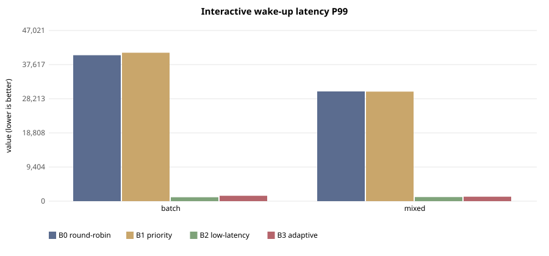
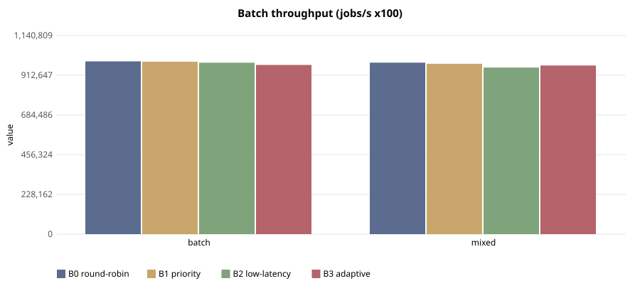

# E-129 — suite `sched`

- Date 2026-09-26T18:17:30Z, commit `4768a1f`, kernel FuhrerOS 0.1.0 (own kernel)
- Host Linux 6.6.87.2-microsoft-standard-WSL2 x86_64 / AMD Ryzen 5 7520U with Radeon Graphics (Windows 11 -> WSL2 -> QEMU; KVM nested inside WSL2 when accel=kvm)
- QEMU emulator version 10.2.1 (Debian 1:10.2.1+ds-1ubuntu3.1), accel **kvm**, 4 vCPU offered (FuhrerOS uses 1), 4096 MB
- virtio-blk, FFS0 raw image, host cache=writeback; virtio-net, QEMU user-mode (slirp)

## Scheduler — scenario `batch` (median of 5 runs; CV%)

| metric | B0 round-robin | B1 priority | B2 low-latency | B3 adaptive |
|---|---|---|---|---|
| dispatch p50 (us) | 39,082 (0%) | 39,081 (0%) | 6 (0%) | 7 (6%) |
| dispatch p99 (us) | 39,222 (1%) | 39,921 (1%) | 38 (19%) | 116 (87%) |
| wake p50 (us) | 40,057 (0%) | 40,056 (0%) | 980 (0%) | 979 (0%) |
| wake p99 (us) | 40,197 (1%) | 40,888 (1%) | 1,068 (2%) | 1,470 (18%) |
| response p99 (us) | 50,235 (1%) | 50,929 (1%) | 11,130 (0%) | 11,511 (4%) |
| batch jobs/s (x100) | 992,008 (1%) | 990,236 (1%) | 984,543 (1%) | 971,569 (2%) |
| I/O ops/s | 0 (0%) | 0 (0%) | 0 (0%) | 0 (0%) |
| fairness (Jain x1000) | 999 (0%) | 999 (0%) | 999 (0%) | 999 (0%) |
| ctx switches/s | 145 (0%) | 145 (0%) | 787 (0%) | 313 (0%) |
| sched overhead ns/s | 25,105 (24%) | 23,265 (7%) | 51,708 (38%) | 31,318 (33%) |
| system class (mid-run) | CPU_BOUND | CPU_BOUND | CPU_BOUND | CPU_BOUND |

Per-worker classes assigned by the kernel at mid-run:

- B0 round-robin: `cpu:CPU_BOUND,cpu:CPU_BOUND,cpu:CPU_BOUND,cpu:CPU_BOUND,probe:INTERACTIVE`
- B1 priority: `cpu:CPU_BOUND,cpu:CPU_BOUND,cpu:CPU_BOUND,cpu:CPU_BOUND,probe:INTERACTIVE`
- B2 low-latency: `cpu:CPU_BOUND,cpu:CPU_BOUND,cpu:CPU_BOUND,cpu:CPU_BOUND,probe:INTERACTIVE`
- B3 adaptive: `cpu:CPU_BOUND,cpu:CPU_BOUND,cpu:CPU_BOUND,cpu:CPU_BOUND,probe:INTERACTIVE`

## Scheduler — scenario `mixed` (median of 5 runs; CV%)

| metric | B0 round-robin | B1 priority | B2 low-latency | B3 adaptive |
|---|---|---|---|---|
| dispatch p50 (us) | 29,063 (0%) | 29,063 (0%) | 8 (10%) | 7 (7%) |
| dispatch p99 (us) | 29,281 (1%) | 29,213 (0%) | 107 (13%) | 70 (46%) |
| wake p50 (us) | 30,036 (0%) | 30,036 (0%) | 979 (0%) | 980 (0%) |
| wake p99 (us) | 30,229 (1%) | 30,185 (0%) | 1,122 (6%) | 1,232 (6%) |
| response p99 (us) | 40,269 (1%) | 40,224 (0%) | 11,170 (1%) | 11,322 (1%) |
| batch jobs/s (x100) | 984,733 (1%) | 978,096 (1%) | 956,852 (1%) | 968,289 (1%) |
| I/O ops/s | 22 (3%) | 21 (3%) | 511 (0%) | 501 (0%) |
| fairness (Jain x1000) | 999 (0%) | 999 (0%) | 999 (0%) | 999 (0%) |
| ctx switches/s | 188 (0%) | 188 (0%) | 1,956 (1%) | 1,755 (0%) |
| sched overhead ns/s | 27,981 (12%) | 27,894 (25%) | 97,693 (25%) | 119,186 (22%) |
| system class (mid-run) | CPU_BOUND | CPU_BOUND | IO_BOUND | IO_BOUND |

Per-worker classes assigned by the kernel at mid-run:

- B0 round-robin: `cpu:CPU_BOUND,cpu:CPU_BOUND,cpu:CPU_BOUND,io:INTERACTIVE,probe:INTERACTIVE`
- B1 priority: `cpu:CPU_BOUND,cpu:CPU_BOUND,cpu:CPU_BOUND,io:INTERACTIVE,probe:INTERACTIVE`
- B2 low-latency: `cpu:CPU_BOUND,cpu:CPU_BOUND,cpu:CPU_BOUND,io:IO_BOUND,probe:INTERACTIVE`
- B3 adaptive: `cpu:CPU_BOUND,cpu:CPU_BOUND,cpu:CPU_BOUND,io:IO_BOUND,probe:INTERACTIVE`

## Threats to validity

- Nested virtualisation (Windows → WSL2 → KVM): absolute times are not bare-metal times; comparisons are between policies within one boot.
- FuhrerOS schedules on one CPU (the BSP); extra vCPUs offered by QEMU are idle.
- Sleepers are woken by the 1000 Hz tick, so *wake* latency includes up to 1 ms of timer granularity whose phase depends on the per-boot LAPIC calibration (F-117): compare wake latency only within one experiment. *Dispatch* latency (runnable → running) does not have this problem.
- Small repetition counts; see CV%.
