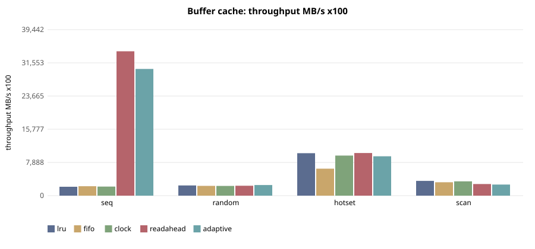
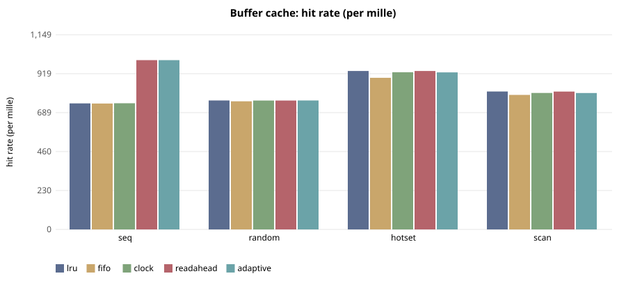

# E-130 — suite `cache`

- Date 2026-09-26T18:24:30Z, commit `4768a1f`, kernel FuhrerOS 0.1.0 (own kernel)
- Host Linux 6.6.87.2-microsoft-standard-WSL2 x86_64 / AMD Ryzen 5 7520U with Radeon Graphics (Windows 11 -> WSL2 -> QEMU; KVM nested inside WSL2 when accel=kvm)
- QEMU emulator version 10.2.1 (Debian 1:10.2.1+ds-1ubuntu3.1), accel **kvm**, 4 vCPU offered (FuhrerOS uses 1), 4096 MB
- virtio-blk, FFS0 raw image, host cache=writeback; virtio-net, QEMU user-mode (slirp)

## Buffer cache — throughput MB/s x100 (median)

| workload | lru | fifo | clock | readahead | adaptive |
|---|---|---|---|---|---|
| seq | 2,118 | 2,242 | 2,153 | 34,297 | 30,104 |
| random | 2,418 | 2,328 | 2,315 | 2,349 | 2,524 |
| hotset | 10,091 | 6,410 | 9,520 | 10,123 | 9,347 |
| scan | 3,514 | 3,184 | 3,388 | 2,756 | 2,637 |

## Buffer cache — hit rate (per mille) (median)

| workload | lru | fifo | clock | readahead | adaptive |
|---|---|---|---|---|---|
| seq | 744 | 743 | 744 | 999 | 999 |
| random | 761 | 756 | 760 | 760 | 761 |
| hotset | 935 | 895 | 928 | 935 | 927 |
| scan | 814 | 794 | 806 | 814 | 805 |

## Buffer cache — read latency p99 (us) (median)

| workload | lru | fifo | clock | readahead | adaptive |
|---|---|---|---|---|---|
| seq | 548 | 464 | 510 | 55 | 78 |
| random | 424 | 474 | 440 | 438 | 376 |
| hotset | 324 | 366 | 300 | 324 | 322 |
| scan | 396 | 397 | 385 | 622 | 670 |

## Buffer cache — cache CPU per read (ns) (median)

| workload | lru | fifo | clock | readahead | adaptive |
|---|---|---|---|---|---|
| seq | 632 | 404 | 604 | 7,174 | 8,362 |
| random | 750 | 774 | 870 | 879 | 711 |
| hotset | 343 | 356 | 264 | 343 | 288 |
| scan | 507 | 450 | 502 | 1,012 | 868 |

## Threats to validity

- Nested virtualisation (Windows → WSL2 → KVM): absolute times are not bare-metal times; comparisons are between policies within one boot.
- FuhrerOS schedules on one CPU (the BSP); extra vCPUs offered by QEMU are idle.
- Sleepers are woken by the 1000 Hz tick, so *wake* latency includes up to 1 ms of timer granularity whose phase depends on the per-boot LAPIC calibration (F-117): compare wake latency only within one experiment. *Dispatch* latency (runnable → running) does not have this problem.
- Small repetition counts; see CV%.
