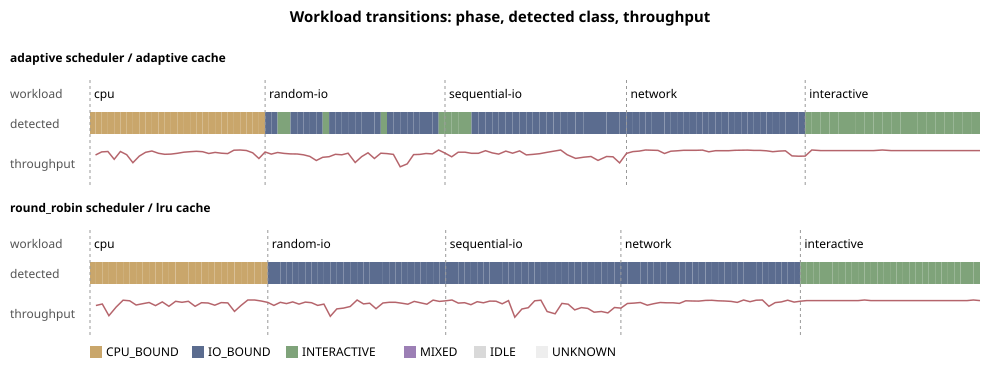

# E-131 — suite `transition`

- Date 2026-09-26T18:28:49Z, commit `4768a1f`, kernel FuhrerOS 0.1.0 (own kernel)
- Host Linux 6.6.87.2-microsoft-standard-WSL2 x86_64 / AMD Ryzen 5 7520U with Radeon Graphics (Windows 11 -> WSL2 -> QEMU; KVM nested inside WSL2 when accel=kvm)
- QEMU emulator version 10.2.1 (Debian 1:10.2.1+ds-1ubuntu3.1), accel **kvm**, 4 vCPU offered (FuhrerOS uses 1), 4096 MB
- virtio-blk, FFS0 raw image, host cache=writeback; virtio-net, QEMU user-mode (slirp)

## Workload transition

| run | detect cpu | detect random-io | detect sequential-io | detect network | detect interactive |
|---|---|---|---|---|---|
| adaptive | 284 ms | 286 ms | 1516 ms | 289 ms | 407 ms |
| round_robin | 303 ms | 289 ms | 287 ms | 304 ms | 299 ms |

Detection = first 250 ms sample in the phase where the kernel's system-level class equals the phase's expected class (cpu→CPU_BOUND, I/O and network→IO_BOUND, interactive→INTERACTIVE).

## Threats to validity

- Nested virtualisation (Windows → WSL2 → KVM): absolute times are not bare-metal times; comparisons are between policies within one boot.
- FuhrerOS schedules on one CPU (the BSP); extra vCPUs offered by QEMU are idle.
- Sleepers are woken by the 1000 Hz tick, so *wake* latency includes up to 1 ms of timer granularity whose phase depends on the per-boot LAPIC calibration (F-117): compare wake latency only within one experiment. *Dispatch* latency (runnable → running) does not have this problem.
- Small repetition counts; see CV%.
