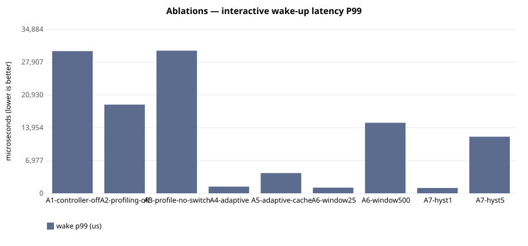

# E-132 — suite `ablation`

- Date 2026-09-26T18:30:24Z, commit `4768a1f`, kernel FuhrerOS 0.1.0 (own kernel)
- Host Linux 6.6.87.2-microsoft-standard-WSL2 x86_64 / AMD Ryzen 5 7520U with Radeon Graphics (Windows 11 -> WSL2 -> QEMU; KVM nested inside WSL2 when accel=kvm)
- QEMU emulator version 10.2.1 (Debian 1:10.2.1+ds-1ubuntu3.1), accel **kvm**, 4 vCPU offered (FuhrerOS uses 1), 4096 MB
- virtio-blk, FFS0 raw image, host cache=writeback; virtio-net, QEMU user-mode (slirp)

## Scheduler — scenario `A1-controller-off` (median of 3 runs; CV%)

| metric | B1 priority |
|---|---|
| dispatch p50 (us) | 29,067 (0%) |
| dispatch p99 (us) | 29,261 (1%) |
| wake p50 (us) | 30,042 (0%) |
| wake p99 (us) | 30,237 (0%) |
| response p99 (us) | 40,276 (0%) |
| batch jobs/s (x100) | 969,827 (1%) |
| I/O ops/s | 21 (0%) |
| fairness (Jain x1000) | 999 (0%) |
| ctx switches/s | 188 (0%) |
| sched overhead ns/s | 27,853 (24%) |
| system class (mid-run) | CPU_BOUND |

Per-worker classes assigned by the kernel at mid-run:

- B1 priority: `cpu:CPU_BOUND,cpu:CPU_BOUND,cpu:CPU_BOUND,io:INTERACTIVE,probe:INTERACTIVE`

## Scheduler — scenario `A2-profiling-off` (median of 3 runs; CV%)

| metric | B3 adaptive |
|---|---|
| dispatch p50 (us) | 11,095 (0%) |
| dispatch p99 (us) | 18,019 (38%) |
| wake p50 (us) | 12,057 (2%) |
| wake p99 (us) | 18,860 (45%) |
| response p99 (us) | 28,900 (32%) |
| batch jobs/s (x100) | 975,074 (14%) |
| I/O ops/s | 45 (7%) |
| fairness (Jain x1000) | 999 (0%) |
| ctx switches/s | 423 (5%) |
| sched overhead ns/s | 44,995 (78%) |
| system class (mid-run) | IDLE |

Per-worker classes assigned by the kernel at mid-run:

- B3 adaptive: `cpu:UNKNOWN,cpu:UNKNOWN,cpu:UNKNOWN,io:UNKNOWN,probe:UNKNOWN`

## Scheduler — scenario `A3-profile-no-switch` (median of 3 runs; CV%)

| metric | B0 round-robin |
|---|---|
| dispatch p50 (us) | 29,066 (0%) |
| dispatch p99 (us) | 29,378 (21%) |
| wake p50 (us) | 30,042 (0%) |
| wake p99 (us) | 30,334 (20%) |
| response p99 (us) | 40,497 (16%) |
| batch jobs/s (x100) | 969,435 (6%) |
| I/O ops/s | 21 (5%) |
| fairness (Jain x1000) | 999 (0%) |
| ctx switches/s | 188 (1%) |
| sched overhead ns/s | 39,739 (28%) |
| system class (mid-run) | CPU_BOUND |

Per-worker classes assigned by the kernel at mid-run:

- B0 round-robin: `cpu:CPU_BOUND,cpu:CPU_BOUND,cpu:CPU_BOUND,io:INTERACTIVE,probe:INTERACTIVE`

## Scheduler — scenario `A4-adaptive` (median of 3 runs; CV%)

| metric | B3 adaptive |
|---|---|
| dispatch p50 (us) | 7 (38%) |
| dispatch p99 (us) | 92 (99%) |
| wake p50 (us) | 981 (0%) |
| wake p99 (us) | 1,422 (97%) |
| response p99 (us) | 11,461 (22%) |
| batch jobs/s (x100) | 959,788 (7%) |
| I/O ops/s | 501 (2%) |
| fairness (Jain x1000) | 999 (0%) |
| ctx switches/s | 1,759 (2%) |
| sched overhead ns/s | 138,345 (68%) |
| system class (mid-run) | IO_BOUND |

Per-worker classes assigned by the kernel at mid-run:

- B3 adaptive: `cpu:CPU_BOUND,cpu:CPU_BOUND,cpu:CPU_BOUND,io:IO_BOUND,probe:INTERACTIVE`

## Scheduler — scenario `A5-adaptive-cache` (median of 3 runs; CV%)

| metric | B3 adaptive |
|---|---|
| dispatch p50 (us) | 7 (39%) |
| dispatch p99 (us) | 272 (118%) |
| wake p50 (us) | 977 (0%) |
| wake p99 (us) | 4,301 (74%) |
| response p99 (us) | 14,341 (22%) |
| batch jobs/s (x100) | 914,110 (5%) |
| I/O ops/s | 498 (1%) |
| fairness (Jain x1000) | 999 (0%) |
| ctx switches/s | 1,753 (1%) |
| sched overhead ns/s | 265,819 (54%) |
| system class (mid-run) | IO_BOUND |

Per-worker classes assigned by the kernel at mid-run:

- B3 adaptive: `cpu:CPU_BOUND,cpu:CPU_BOUND,cpu:CPU_BOUND,io:IO_BOUND,probe:INTERACTIVE`

## Scheduler — scenario `A6-window25` (median of 3 runs; CV%)

| metric | B3 adaptive |
|---|---|
| dispatch p50 (us) | 7 (0%) |
| dispatch p99 (us) | 100 (41%) |
| wake p50 (us) | 980 (0%) |
| wake p99 (us) | 1,193 (9%) |
| response p99 (us) | 11,325 (2%) |
| batch jobs/s (x100) | 949,204 (2%) |
| I/O ops/s | 503 (1%) |
| fairness (Jain x1000) | 999 (0%) |
| ctx switches/s | 1,768 (0%) |
| sched overhead ns/s | 221,927 (45%) |
| system class (mid-run) | IO_BOUND |

Per-worker classes assigned by the kernel at mid-run:

- B3 adaptive: `cpu:CPU_BOUND,cpu:CPU_BOUND,cpu:CPU_BOUND,io:IO_BOUND,probe:INTERACTIVE` | `cpu:IDLE,cpu:CPU_BOUND,cpu:CPU_BOUND,io:IO_BOUND,probe:INTERACTIVE`

## Scheduler — scenario `A6-window500` (median of 3 runs; CV%)

| metric | B3 adaptive |
|---|---|
| dispatch p50 (us) | 7 (72%) |
| dispatch p99 (us) | 13,091 (12%) |
| wake p50 (us) | 982 (1%) |
| wake p99 (us) | 15,001 (12%) |
| response p99 (us) | 25,040 (7%) |
| batch jobs/s (x100) | 969,621 (14%) |
| I/O ops/s | 465 (6%) |
| fairness (Jain x1000) | 999 (0%) |
| ctx switches/s | 1,659 (6%) |
| sched overhead ns/s | 122,207 (111%) |
| system class (mid-run) | IO_BOUND |

Per-worker classes assigned by the kernel at mid-run:

- B3 adaptive: `cpu:CPU_BOUND,cpu:CPU_BOUND,cpu:CPU_BOUND,io:IO_BOUND,probe:INTERACTIVE`

## Scheduler — scenario `A7-hyst1` (median of 3 runs; CV%)

| metric | B3 adaptive |
|---|---|
| dispatch p50 (us) | 7 (79%) |
| dispatch p99 (us) | 76 (148%) |
| wake p50 (us) | 981 (2%) |
| wake p99 (us) | 1,129 (105%) |
| response p99 (us) | 11,176 (23%) |
| batch jobs/s (x100) | 942,914 (14%) |
| I/O ops/s | 506 (4%) |
| fairness (Jain x1000) | 999 (0%) |
| ctx switches/s | 1,770 (3%) |
| sched overhead ns/s | 156,453 (101%) |
| system class (mid-run) | IO_BOUND |

Per-worker classes assigned by the kernel at mid-run:

- B3 adaptive: `cpu:CPU_BOUND,cpu:CPU_BOUND,cpu:CPU_BOUND,io:IO_BOUND,probe:INTERACTIVE`

## Scheduler — scenario `A7-hyst5` (median of 3 runs; CV%)

| metric | B3 adaptive |
|---|---|
| dispatch p50 (us) | 7 (14%) |
| dispatch p99 (us) | 10,966 (1%) |
| wake p50 (us) | 982 (0%) |
| wake p99 (us) | 12,036 (5%) |
| response p99 (us) | 22,075 (3%) |
| batch jobs/s (x100) | 956,978 (5%) |
| I/O ops/s | 486 (1%) |
| fairness (Jain x1000) | 999 (0%) |
| ctx switches/s | 1,723 (1%) |
| sched overhead ns/s | 116,927 (46%) |
| system class (mid-run) | IO_BOUND |

Per-worker classes assigned by the kernel at mid-run:

- B3 adaptive: `cpu:CPU_BOUND,cpu:CPU_BOUND,cpu:CPU_BOUND,io:IO_BOUND,probe:INTERACTIVE`

## Threats to validity

- Nested virtualisation (Windows → WSL2 → KVM): absolute times are not bare-metal times; comparisons are between policies within one boot.
- FuhrerOS schedules on one CPU (the BSP); extra vCPUs offered by QEMU are idle.
- Sleepers are woken by the 1000 Hz tick, so *wake* latency includes up to 1 ms of timer granularity whose phase depends on the per-boot LAPIC calibration (F-117): compare wake latency only within one experiment. *Dispatch* latency (runnable → running) does not have this problem.
- Small repetition counts; see CV%.
